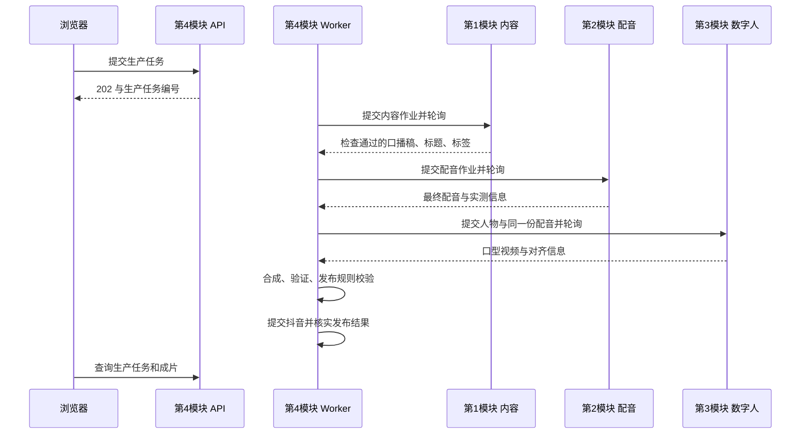

# 四模块 HTTP 接口协议 v1

状态：**HTTP 接口待四位负责人评审；首版媒体规格已由用户确认（2026-09-22）**。本文件明确首版接口形状与语义；端口、实际资源编号和模型兼容性需在联调前登记与验证。确认规格不代表模型能力已验证。

当前代码仅实现 `/api/health`、`/api/checks` 等环境自检接口。下列业务接口尚未实现，不能据此宣称生成或发布已接通。领域用语见 [CONTEXT.md](../CONTEXT.md)，职责依据见 [技术框架](技术框架.md)。

## 1. 调用关系与责任

第 4 模块提供浏览器业务 API，独立 Worker 持久化流程进度并顺序调用前三个模块。前三个模块不互相调用，也不直接发布抖音。



| 服务 | 维护者 | 接口前缀 | 接收与交付 |
| --- | --- | --- | --- |
| 内容 | 第 1 人 | `/v1/content` | 主题／修改意见 → 检查通过的口播稿、标题、标签 |
| 配音 | 第 2 人 | `/v1/speech` | 最终口播稿与音色 → 最终配音 |
| 数字人 | 第 3 人 | `/v1/video` | 人物资源与最终配音 → 口型视频 |
| 集成 | 第 4 人 | `/api/v1` | 主题、人物、音色和目标账号 → 生产进度、成片、发布结果 |

合成是第 4 模块内部阶段，不额外部署第五个服务。模型名称、密钥、检查与改稿循环属于内容模块内部配置；配音与数字人供应商细节分别封装在对应模块。

## 2. 公共 HTTP 约定

- 接口路径包含主版本 `v1`；请求与响应使用 UTF-8 JSON、`snake_case` 字段，二进制预览接口除外。
- 本版服务绑定 `127.0.0.1`，地址由部署配置指定，调用方不得写死端口。容器场景需要另行配置受限网络和共享目录映射。
- 服务鉴权配置了令牌时，使用 `Authorization: Bearer <令牌>`；就绪检查和业务接口均校验，错误返回 401。未配置时仅用于受控本机联调。不得将模型密钥当作模块令牌。
- 调用方生成 UUID 格式的 `X-Request-ID`，响应原样返回；缺失时服务端生成。一次 HTTP 重试使用新的请求编号；该编号只用于追踪，不能替代幂等键。
- 所有创建接口必须传 `Idempotency-Key`，使用调用方预先持久化的 UUID。缺失或格式错误返回 422。
- 时间统一为 UTC RFC 3339 字符串，如 `2026-09-22T03:00:00Z`；时长和偏移使用整数毫秒，采样率使用 Hz，帧率使用分数形式如 `25/1`。
- v1 拒绝未知请求字段（422），避免拼写错误静默生效；客户端应忽略未知响应字段。删除字段、改变含义或增加必填请求字段时升主版本。
- 本协议表格中注明可省略的字段才可省略；标注可空的字段需要显式返回 `null`。字符串默认非空且去除首尾空白；JSON 不允许 NaN 或 Infinity。

### 幂等提交、超时与重启

幂等键的作用域是服务、认证调用方及创建路径。同一键与相同请求返回同一个作业／生产任务；不同请求返回 `409 IDEMPOTENCY_CONFLICT`。按校验并补全默认值后的 JSON 比较语义，不受对象字段顺序或空白影响，数组顺序有意义。

首次创建返回 202；重放返回 200，携带该作业当前状态，不重跑已完成或失败作业。返回 `Location` 指向同服务的查询路径。登记幂等键、请求和作业必须原子持久化后再返回 202，并覆盖并发重复请求。

作业和幂等记录首版不自动过期；人工归档应保留已使用键的占位记录，再次提交返回 `410 JOB_EXPIRED`，不得重新执行。所有模块在重启后保留可查询记录；无法恢复的执行标为 `failed / EXECUTION_INTERRUPTED`，不能静默重跑供应商调用。

Worker 在发请求前保存请求体及幂等键。POST 超时或连接中断不代表未受理，只能使用**相同请求体和相同键**重试；不能自动生成新键。失败作业需要明确重做时才建立新键和新作业，并记录前一次作业编号。

联调建议：连接超时 3 秒、单次 HTTP 响应超时 10 秒、轮询间隔 2 秒；各阶段总执行截止时间单独配置，由模块负责人按实测登记。总截止时间耗尽只停止等待并记录“等待超时”，不能假设远端已停止。首版没有取消接口，重新提交前须核实原作业，避免重复收费或重复发布。

## 3. 统一作业状态与错误

前三个模块共享以下生命周期；`queued` 表示已受理，不承诺多任务调度能力。

```text
queued → running → succeeded
   └─────────────→ failed
           running → failed
```

`succeeded` 和 `failed` 是不可变终态。查询任何已知作业均返回 HTTP 200，业务执行失败通过 `state` 和 `error` 表达；HTTP 失败表示本次请求本身未正常完成。

提交及查询响应字段相同：

| 字段 | 类型 | 约束 |
| --- | --- | --- |
| `job_id` | UUID 字符串 | 本模块作业编号 |
| `task_id` | UUID 字符串 | 集成模块生产任务编号，原样回传 |
| `state` | 枚举 | `queued / running / succeeded / failed` |
| `created_at`、`updated_at` | 时间字符串 | 创建与最后状态更新时刻 |
| `result` | 对象或 null | 仅成功时非空，类型取决于模块 |
| `error` | 对象或 null | 仅失败时非空 |

```json
{
  "job_id": "22222222-2222-4222-8222-222222222222",
  "task_id": "11111111-1111-4111-8111-111111111111",
  "state": "queued",
  "created_at": "2026-09-22T03:00:00Z",
  "updated_at": "2026-09-22T03:00:00Z",
  "result": null,
  "error": null
}
```

公共错误对象为 `code`（稳定英文码）、`message`（中文说明）、`retryable`（布尔值）、`details`（对象）。HTTP 错误统一封装为：

```json
{
  "request_id": "33333333-3333-4333-8333-333333333333",
  "error": {
    "code": "INVALID_ARGUMENT",
    "message": "topic 不能为空",
    "retryable": false,
    "details": {"field": "topic"}
  }
}
```

| HTTP 状态 | 错误码 | 处理 |
| --- | --- | --- |
| 400 | `INVALID_JSON` | 修正请求编码或 JSON |
| 401 | `UNAUTHORIZED` | 配置正确的模块令牌 |
| 404 | `JOB_NOT_FOUND`、`TASK_NOT_FOUND`、`RESOURCE_NOT_FOUND` | 核对编号与目标服务，不自动重建作业 |
| 409 | `IDEMPOTENCY_CONFLICT`、`SERVICE_BUSY` | 前者修正调用逻辑；后者稍后用原键重试 |
| 410 | `JOB_EXPIRED` | 核查已归档作业，禁止以原键重跑 |
| 422 | `INVALID_ARGUMENT`、`UNSUPPORTED_PROFILE`、`ASSET_INVALID` | 修正参数、配置档或素材 |
| 429 | `RATE_LIMITED` | 按 `Retry-After` 的秒数退避 |
| 503 | `SERVICE_NOT_READY` | 等服务恢复后以原键重试 |
| 500 | `INTERNAL_ERROR` | 保留请求编号排查，POST 是否受理按幂等规则核实 |

容量暂满返回 409 `SERVICE_BUSY` 和 `Retry-After`；接收前拒绝的请求不创建作业。异步失败还可使用 `CONTENT_REJECTED`、`UPSTREAM_FAILED`、`EXECUTION_INTERRUPTED`、`ASSET_INVALID`。`retryable=true` 仅表示故障可能恢复，不授权重复发布或用新键重做；错误不得包含密钥、堆栈或整份上游原始响应。

## 4. 文件交接与资源能力

所有模块将同一物理资产目录作为根目录，默认是 `VIDEO_DATA_DIR/assets`。请求与响应只传相对此根目录的路径，用 `/` 分隔；示例 `tasks/<task_id>/speech/<job_id>/audio.wav`。

公共 `AssetRef` 对象：

| 字段 | 类型 | 约束 |
| --- | --- | --- |
| `path` | 字符串 | 非空相对路径；禁止盘符、UNC、反斜杠、绝对路径、`.`、`..` 或空路径段 |
| `sha256` | 字符串 | 文件字节的 64 位小写十六进制摘要 |
| `size_bytes` | 整数 | 大于 0 |
| `media_type` | 字符串 | 实际格式，如 `audio/wav`、`video/mp4` |

接收方解析符号链接／Windows 目录联接后必须仍位于资产根目录下；消费前核对文件存在、大小、摘要和实际媒体格式。`path` 是文件名，不做 URL 解码，不允许传任意 HTTP URL 触发下载。

生产方先写临时文件，完成后原子改名，再记录结果并置为成功；成功交付文件不可覆盖。不同作业写不同目录。首版不自动清理被作业引用的文件，避免消费者拿到结果后文件消失。浏览器只从集成模块的预览接口读取成片。

### 就绪检查与能力声明

前三个模块分别提供 `GET /v1/<模块>/health` 和 `GET /v1/<模块>/capabilities`。前者返回 `{service, api_version, ready}`，其中 `service` 为 `content / speech / video`，`api_version` 为 `1.0`；就绪返回 200，否则 503 并使用公共错误对象。检查不得实际发起收费推理。

后者返回 `{service, api_version, profiles, resources}`：

- `profiles` 为数组，每项包含 `profile_id`（稳定版本号）、`input_constraints` 和 `output_constraints`（对象）。内容服务可返回空数组。
- 配音配置档至少声明 `max_text_chars`、`output_constraints.media_type`、`codec`、`sample_rate_hz`、`channels`。
- 数字人配置档至少声明 `input_constraints.audio_media_types`、`audio_codecs`、`sample_rates_hz`、`channels`（均为数组）、`max_audio_duration_ms`；输出声明 `media_type`、`codec`、`width`、`height`、`fps`、`has_audio`。
- `resources` 为数组，每项包含 `resource_id`、`display_name`、`kind`（`voice / avatar`）和 `profile_ids`（可用配置档编号数组）。内容服务返回空数组。
- 接口单位沿用公共约定，格式与参数限制必须可由调用方检查。配置档语义不可原地修改，改变格式或约束时分配新 `profile_id`。

第 2、3 人按下列已确认基线验证首组兼容配置档。第 4 人保存项目人物 `avatar_id` 到数字人服务 `avatar_resource_id` 的映射；人物上传、训练、维护由独立模块完成，首版生成请求只引用已经可用的资源。

### 首版媒体规格（已确认）

| 项目 | 联调基线 | 交付责任 |
| --- | --- | --- |
| 最终配音 | WAV、PCM 16 位有符号小端（`pcm_s16le`）、单声道 | 第 2 人 |
| 配音采样率 | 优先保留 TTS 原生采样率，首轮优先验证 24000 Hz | 第 2、3 人确认兼容性 |
| 口型视频与成片尺寸 | 720×1280、9:16 竖屏 | 第 3、4 人 |
| 视频帧率 | 恒定 25 fps，接口返回 `25/1` | 第 3、4 人 |
| 视频封装与编码 | MP4、H.264（探测名称 `h264`）、像素格式 `yuv420p` | 第 3、4 人 |
| 数字人交付音轨 | 优先交付无音轨视频；有音轨时集成明确弃用 | 第 3、4 人 |
| 成片音轨 | 从最终配音编码为 AAC，目标码率 128 kbps | 第 4 人 |
| 起点对齐 | 优先 `audio_offset_ms=0`；必须前导时返回实测偏移，补偿后起点误差目标不超过 40 毫秒（一帧） | 第 3、4 人 |
| 联调素材长度 | 先约 10 秒中文口播，再约 30 秒；按实际配音时长记录 | 第 2、3、4 人 |

以上是内部交付规格，抖音上传限制在正式接入时另行核验。25 fps 和目标尺寸需所选模型验证；无法满足时应报告具体限制并修订配置档，不能静默以其他规格交付。

首个配音配置档建议编号 `speech-pcm16-mono-24k-v1`，仅在实际交付 24000 Hz 时使用。如果 TTS 原生输出为其他采样率，优先保留原生输出，登记含真实采样率的新配置档并核对数字人兼容性，不为了满足编号升采样。数字人可在内部转换为模型要求的采样率（例如 16000 Hz），但输出必须保持原始配音时间轴；集成仍使用原始 WAV。

首个视频配置档建议编号 `portrait-720x1280-25fps-v1`，能力声明中填写实测可接受的音频配置、最大时长和是否含音轨。像素格式在能力的 `output_constraints.pixel_format` 以及视频成功结果的 `pixel_format` 字段中返回。10 秒和 30 秒是分阶段验收样例，不是未经验证的服务最大时长。

### 首版人物资源（已确认）

- 先准备一个固定人物，项目人物与数字人资源分别编号；例如项目 `avatar-demo` 映射到服务资源 `avatar-demo-v1`。这些示例编号在资源实际准备完成后才可用于任务。
- 所选模型支持照片驱动时，优先用清晰、单人、正脸或轻微侧脸、嘴部无遮挡的照片；若模型需要驱动视频或训练产物，由第 3 人预处理完成后登记资源。本协议不强制模型必须支持单照片驱动。
- 人物素材或模型发生变化时创建新资源版本，例如 `avatar-demo-v2`，不原地替换已交付资源；旧任务保存所用版本。
- 人物与音色分别选择，首版可以登记默认配对。服务的能力声明只列出已经可用于生成的资源，尚在准备或训练中的资源不能作为就绪资源返回。

### 首轮验收方法

第 2、3 人使用同一份约 10 秒中文配音完成一次数字人生成，第 4 人合成后检查实际编码、采样率、像素格式、尺寸、恒定帧率、起点及结尾，并人工检查人物稳定性和嘴型。记录资源版本、配置档、各阶段耗时与产物摘要，再重复约 30 秒样例。

配音不得被变速、截断或删去首尾静音，视频必须覆盖完整配音区间。40 毫秒目标只约束整体起点，不等于局部嘴型质量通过；嘴型仍须人工查看核验。兼容性或质量不通过时由对应负责人修复，再登记可用配置档。

## 5. 第 1 模块：内容生成

`POST /v1/content/jobs` 提交，`GET /v1/content/jobs/{job_id}` 查询。

| 请求字段 | 类型 | 约束 |
| --- | --- | --- |
| `task_id` | UUID 字符串 | 必填 |
| `topic` | 字符串 | 必填，1–2000 个 Unicode 字符 |
| `revision` | 对象 | 可省略；包含 `source_job_id`（同一生产任务已成功的内容作业）和 `instructions`（1–4000 字） |

```json
{
  "task_id": "11111111-1111-4111-8111-111111111111",
  "topic": "介绍新手如何养护绿萝"
}
```

成功响应的 `result`：

```json
{
  "script": "新手养绿萝，可以先从光照和浇水入手。",
  "title": "新手养绿萝的两个要点",
  "tags": ["绿萝", "养花入门"],
  "review_passed": true
}
```

`script`、`title` 为非空字符串；`tags` 为可空数组，元素为不带 `#` 的非空字符串，去重但保留顺序；`review_passed` 在成功结果中必须是 `true`。标题、标签是否符合平台限制，由第 4 模块发布规则最终校验。内容模块内部完成写稿、检查和必要改稿；达到内部返工上限仍未通过时返回失败 `CONTENT_REJECTED`，不得把未通过稿件交给配音。

`revision` 生成新的作业与内容版本，不覆盖原结果；重做后重新生成下游配音与视频，不能复用旧配音。跨任务或非成功的 `source_job_id` 返回 422。自动检查改稿不需要 Worker 逐轮调用此字段；它用于明确的外部修改需求。

## 6. 第 2 模块：配音

`POST /v1/speech/jobs` 提交，`GET /v1/speech/jobs/{job_id}` 查询。

```json
{
  "task_id": "11111111-1111-4111-8111-111111111111",
  "content_job_id": "22222222-2222-4222-8222-222222222222",
  "text": "新手养绿萝，可以先从光照和浇水入手。",
  "voice_id": "voice-default",
  "profile_id": "speech-pcm16-mono-24k-v1"
}
```

全部字段必填。前两个字段为 UUID；其余为非空字符串，`text` 受配置档长度限制。Worker 保证 `text` 与已通过检查的 `script` 完全一致，配音模块不得自行改写含义；可在内部处理朗读和停顿。`voice_id` 必须是配音能力声明中适用该配置档的资源。

成功结果包含以下必填字段：

| 字段 | 类型 | 含义 |
| --- | --- | --- |
| `content_job_id` | UUID 字符串 | 原样回传，用于追踪内容版本 |
| `audio` | AssetRef | 最终配音文件 |
| `duration_ms` | 正整数 | 文件解码后的总时长，包含需要保留的首尾静音 |
| `codec` | 字符串 | 实测编码，如 `pcm_s16le` |
| `sample_rate_hz`、`channels` | 正整数 | 实测采样率与声道数 |

音频开始定义为最终配音解码时间零点。第 3、4 人均使用这个零点；不允许某个模块自行删去静音后仍宣称使用原配音。

## 7. 第 3 模块：数字人

`POST /v1/video/jobs` 提交，`GET /v1/video/jobs/{job_id}` 查询。

```json
{
  "task_id": "11111111-1111-4111-8111-111111111111",
  "speech_job_id": "44444444-4444-4444-8444-444444444444",
  "avatar_resource_id": "avatar-demo-v1",
  "profile_id": "portrait-720x1280-25fps-v1",
  "audio": {
    "path": "tasks/11111111-1111-4111-8111-111111111111/speech/44444444-4444-4444-8444-444444444444/audio.wav",
    "sha256": "aaaaaaaaaaaaaaaaaaaaaaaaaaaaaaaaaaaaaaaaaaaaaaaaaaaaaaaaaaaaaaaa",
    "size_bytes": 96044,
    "media_type": "audio/wav"
  }
}
```

全部字段必填；编号字段为 UUID 或能力声明中的非空资源／配置档 ID。示例摘要仅展示格式，实测时必须替换为文件真实摘要。Worker 将配音结果里的 `audio` 原样传入；服务自行探测时长和格式，校验配置档限制。

成功 `result` 必填字段：

| 字段 | 类型 | 含义 |
| --- | --- | --- |
| `speech_job_id` | UUID 字符串 | 使用的配音作业 |
| `source_audio_sha256` | 64 位摘要字符串 | 必须等于请求的音频摘要 |
| `video` | AssetRef | 口型视频 |
| `duration_ms` | 正整数 | 实测画面总时长 |
| `codec` | 字符串 | 实测视频编码 |
| `pixel_format` | 字符串 | 实测像素格式；首版为 `yuv420p` |
| `width`、`height` | 正整数 | 画面像素尺寸 |
| `fps` | 字符串 | 正整数分子／正整数分母 |
| `has_audio` | 布尔值 | 输出中是否包含音轨 |
| `audio_offset_ms` | 非负整数 | 输入配音时间零点对应输出视频时间轴的位置 |

若偏移为 200，则配音的第 0 毫秒对应视频第 200 毫秒，第 4 人在视频起点补 200 毫秒静音后放入原配音。服务需保证画面覆盖完整配音区间；v1 不支持负偏移、配音截断或变速。帧边界舍入最多允许一帧，尾部超出与裁剪策略在配置档联调时核定，不能用 `-shortest` 静默截掉正文。

输出若含音轨，第 4 模块仍明确选择原配音，不能误用供应商生成的声音。供应商需要内部重采样时可自行处理，但必须保持原音频时间轴和语义；失败返回不兼容错误。嘴型错误归第 3 模块处理，整体平移无法修正局部嘴型错误。

## 8. 第 4 模块：生产任务、预览与发布

| 接口 | 行为 |
| --- | --- |
| `POST /api/v1/tasks` | 创建生产任务，202；相同幂等键重放为 200 |
| `GET /api/v1/tasks/{task_id}` | 返回当前流程阶段、作业引用、成片与发布结果 |
| `GET /api/v1/tasks/{task_id}/video` | 成片可用时返回 `video/mp4`，支持 Range（206）；合法但不可满足的范围返回 416 |

```json
{
  "topic": "介绍新手如何养护绿萝",
  "avatar_id": "avatar-demo",
  "voice_id": "voice-default",
  "publish_account_id": "douyin-account-demo"
}
```

全部必填；`topic` 限制同内容接口，其他为非空标识符。项目人物映射、兼容配置档与授权账号在服务端维护并在受理时保存快照，执行中不得因配置修改替换用户已选资源。生产任务由集成模块分配 UUID。

首版同时只运行一条生产链路；已有活动任务时，新幂等键返回 409 `SERVICE_BUSY`，同键重放仍返回原任务。外部账号授权、发布规则、资源映射或兼容配置档未就绪时先返回 503 `SERVICE_NOT_READY`，避免先收费生成再发现无法交付。

生产任务响应：

```json
{
  "task_id": "11111111-1111-4111-8111-111111111111",
  "state": "running",
  "stage": "speech",
  "created_at": "2026-09-22T03:00:00Z",
  "updated_at": "2026-09-22T03:00:05Z",
  "jobs": {
    "content": "22222222-2222-4222-8222-222222222222",
    "speech": "44444444-4444-4444-8444-444444444444",
    "video": null
  },
  "final_video": null,
  "publication": {
    "state": "not_started",
    "platform": "douyin",
    "account_id": "douyin-account-demo",
    "submission_id": null,
    "platform_video_id": null,
    "published_at": null
  },
  "error": null
}
```

- 顶层字段全部返回。`jobs` 三个字段为 UUID 或 null，保留最近一次作业引用；完整重做历史由集成模块持久化。
- `state`：`queued / running / waiting_external / succeeded / failed`。受理进入 queued，执行进入 running；可进入 waiting_external 后恢复 running 或进入终态；queued 也可直接失败。终态不可变，重做创建新生产任务。
- `stage`：`content / speech / video / integration / publication / completed`。初始为 content，失败或等待时保留所在阶段，仅成功时为 completed。
- `final_video`：未生成时为 null；生成后为 `{asset: AssetRef, duration_ms: 正整数, width: 正整数, height: 正整数, fps: 分数字符串}`。即使随后发布失败，也保留可预览成片。请求不存在任务或暂无成片返回 404 公共错误对象；支持 HTTP Range 与内容类型响应。
- `publication.state`：`not_started / submitted / processing / published / failed / unknown`。平台字段均为字符串或 null；`published_at` 为 UTC 时间或 null，仅确认 published 时填写。不能将上传成功或提交受理直接映射为 published。
- 生产任务仅在发布确认 published 后进入 succeeded；发布失败则 failed，`error` 使用公共错误对象；waiting_external 时也通过 `error` 说明等待原因（如 `WAIT_TIMEOUT`），恢复后清空。
- 发布提交响应丢失、供应商状态不明或远端作业总等待超时，使用 waiting_external；发布不明时 publication.state 为 unknown。占用当前生产链路，先核实已有提交，不盲目新建。发布接口是否支持幂等及如何核实，必须等抖音接入能力验证后实现，不能假设平台支持。

前三模块重启恢复与集成恢复要分别实现。集成 Worker 重启后按持久化的模块作业编号查询；若尚未拿到编号，以原幂等键补交。内容通过、音频完成、视频完成、成片完成和发布受理均单独落库，禁止重启从头执行。

## 9. 联调验收与落地顺序

四人评审后先共同锁定 v1 字段，再各自实现；实现阶段补充 OpenAPI 文件或由公共数据模型生成，不手工维护互相矛盾的两套定义。

| 场景 | 验收条件 | 责任方 |
| --- | --- | --- |
| 正常作业 | 202、Location、查询状态和结果结构一致 | 前三模块 |
| POST 响应丢失／并发重复提交 | 同键同请求始终仅一个作业，同键不同请求为 409 | 四模块 |
| 服务重启 | 旧编号可查询，不重复生成；无法续跑有明确失败 | 四模块 |
| 文件尚未完成或被修改 | 不报成功；消费方拒绝缺失、大小／摘要不符文件 | 第 2、3、4 模块 |
| 路径越界 | 绝对路径、上级路径、目录联接越界均拒绝 | 第 2、3、4 模块 |
| 内容未通过检查 | 明确失败，配音作业未创建 | 第 1、4 模块 |
| 版本不匹配 | 拒绝不兼容配置档；改稿后不复用旧配音／视频 | 四模块 |
| 配音一致性 | 数字人引用摘要与原音频相同，成片选用原配音 | 第 2、3、4 模块 |
| 对齐与时长 | 实测口型、起点、结尾；非零偏移可解释，无正文截断 | 第 3、4 模块 |
| 发布结果不明 | 保留提交引用，标记 waiting_external，不重复发布 | 第 4 模块 |
| 真实全流程 | 一条主题得到可播放成片和可核实平台发布结果 | 四模块 |

落地顺序：① 每位负责人登记服务地址、能力和素材资源；② 实现公共请求／响应模型及契约测试；③ 前三模块实现提交、查询、幂等持久化；④ 第 4 人串联 Worker 和共享目录验证；⑤ 接真实模型验证一条成片；⑥ 完成抖音授权、规则及发布确认。模拟服务只能用于协议联调，不计入真实全流程验收。

评审时尚需提供的具体信息：第 1 人的内容限制与合理截止时间；第 2 人的实际音色编号、原生采样率与配置档；第 3 人的实际人物资源编号、接受的音频配置档及已确认媒体规格的实测结果；第 4 人的服务部署地址、人物映射、目标账号和发布规则。填写这些信息不改变已约定的职责边界；模型能力若不能满足基线，应明确提出调整。
