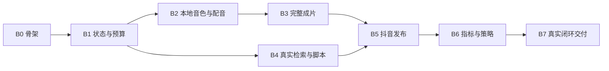

# 首期开发实施计划

版本：v0.1  
依据：[PRD v0.35](视频生成平台PRD.md)、[技术方案](技术方案.md)  
状态：开发拆分和目录骨架已完成，空目录使用 `.gitkeep` 保存；尚未生成应用代码、部署模型或调用付费接口。

## 1. 执行原则

先搭建可恢复的最小任务骨架，再完成“真实脚本→本地配音→口型视频”，随后接入真实检索、发布、指标和策略。每批次交付可运行的纵向功能，不能只做页面或空接口。

按用户判断的技术可行前提推进。账号授权、百炼具体模型与 GPU 运行是接入任务；开发不等待全部权限齐备才开始。真实发布与真实指标只在接入条件准备后验收，临时替身必须标为模拟。

批次不等于一个大提交；按下列顺序在实际开发中拆成可独立验证的变更。目录骨架与文档纳入 Git 版本管理，目标远端为 `https://github.com/accountisnull/VideoGenerate.git`。

## 2. 推荐开发批次

### B0 工程骨架与配置模板

交付：Python 应用与 Worker 入口、React 页面骨架、迁移、日志、健康检查、启动/停止/状态脚本；创建唯一初始账号模板和 AI 办公/会议记录/文档处理主题。

顺序：

1. 依赖锁定与目录、环境配置样例，忽略密钥/模型/数据产物。
2. SQLite 迁移、账号及不可变配置、主主题/优先级枚举。
3. 前端配置页与健康状态，初始主题中档、定时关闭。
4. Windows 后台生命周期脚本，关闭网页后进程继续运行。

验收：本机可启动和退出；配置重启后仍存在；未配置提供方显示原因，不显示“已连接”。不要求此时外部模型可用。

### B1 持久化生产骨架与预算

交付：手动创建任务、阶段作业、租约、产物版本、人工确认、预算台账和审计；用明确标识的测试 Adapter 跑通骨架。

顺序：

1. task/step/job/operation/approval 表与任务详情查询。
2. 三个确认节点、expected_revision、输入指纹和依赖失效。
3. 有限重试、unknown/reconcile、取消与重启恢复。
4. 200 元总额、首轮 50 元预留、160 元提醒与阶段结束动作。
5. 配置/控制的快照和实时规则分离，防止旧确认放行新版本。

验收：重复点击不重复任务；修改与确认竞争可控；外部未知不重提；费用模拟值验证限额，不实际消费至阈值。此阶段不对外宣称已完成视频闭环。

### B2 本地 CosyVoice 3、参考音色与字幕时间轴

交付：GPU 容器构建、参考音频上传、转写文字、试听确认、音色复用、异步 TTS 作业、句段音频拼接及字幕产物。

顺序：

1. 固定官方代码/权重版本，记录模型许可与依赖；验证 GPU 透传，不启动其他模型。
2. 包装原始 PCM 输出为正确 WAV；短句合成并记录真实时长/资源。
3. 音色版本、试听确认和跨重启重建 speaker 缓存。
4. 分句合成、样本数测量、停顿拼接、cue/SRT/ASS 导出。
5. 使用真实口播稿生成 30～60 秒音频，验证人声、自然度与段间衔接。

验收：用户确认的固定音色可复用，未确认音色不能生产；修改音色只使相关下游失效；服务断开/显存不足可恢复；没有逐字时间戳时不伪造逐字对齐。

用户需要在此批次提供参考录音和对应文字；未提供之前可实现上传和调度逻辑，不能将其他声音冒充用户音色验收。

### B3 百炼生成与完整成片

交付：文本、文生图、音频驱动数字人 Adapter；上传形象和文生图两入口；30～60 秒、9:16、720×1280 的单数字人成片。

顺序：

1. 记录实际模型、调用地域、价格、时长和异步操作限制。
2. 上传形象/文生图结果检查和显式选择，保留历史图片版本。
3. 最终脚本输入本地 TTS，实际音频驱动数字人；核验音色不被重配。
4. 合成固定背景、最终音轨和同步字幕；基础检查与预览。
5. 脚本时长修正、形象变更、媒体失败后的阶段恢复。

验收：两种形象入口均验证到实际成片，记录每个 API 调用费用；完成首轮能力记录后由用户显式结束 50 元阶段，不能自动提高限额。

### B4 账号主题检索与内容推理

交付：一个真实检索渠道、来源抓取、事件合并、确定性筛选排序、主主题、deepagents 内容角色与 Skills。

顺序：

1. search/fetch 的只读 MCP 或直接协议 Adapter，结构化来源和热度字段。
2. 近 7 天窗口、排除范围、账号相关性和无结果跳过。
3. 热点优先、无热点资讯补位；主主题高/中/低与同档排序。
4. 带事实引用的脚本、独立检查、人工选题和稿件修改。
5. 账号内事件占位与已发布去重，记录实质性进展区别。

验收：不依赖抖音热榜，外部新闻不被误称为抖音热点；每条作品唯一主主题；按首个测试账号真实资料产出视频。

### B5 抖音发布、排期和生产调度

交付：授权配置、发布 Adapter、作品状态核对、立即/指定时间发布、时效复查和每日生产计划。

顺序：

1. 测试账号、应用与权限接入；先验证可用字段和操作含义，再固定 Adapter。
2. 发布记录和文件上传，合成标识、标题标签与成片绑定。
3. 发布前最后检查、幂等、提交未知时核对，平台审核状态映射。
4. 定时生产默认关闭、开启后每日一次；错过不补产。
5. 指定时间发布、错过转待处理、过期暂停与显式应用新时效范围。

验收：至少一个真实可核验抖音作品标识；超时不重复发布；停机/恢复/模式切换时不放行旧确认或过期内容。账号未准备时可以完成合同测试，但 B5 的真实验收保持未完成。

### B6 指标回收与策略闭环

交付：指标快照、24 小时观测、30 天主题中位数、策略建议及人工生效、回滚。

顺序：

1. 字段可用性与来源口径，真实零值、缺失、不支持分开。
2. 小时采样和 24h 目标采样，停机缺口不伪造；主主题统计。
3. 回看范围、median 与互动辅助展示，低样本探索标记。
4. 每天至多一次自动评估、手动评估、同依据复用和单个待确认建议。
5. 人工确认相邻档变化、版本回滚、过时建议冲突检测。

验收：真实指标支持至少一次有记录的优先级调整，下一条任务实际读取该档位排序；不要求结果必须换一个选题或流量增长；策略批准不会创建新视频。

### B7 完整演示与交付

交付：可启动工程、使用说明、示例配置、备份/恢复脚本、验收记录和已知限制。

完整演示：账号配置 → 真实检索 → 确认选题与稿件 → 本地克隆配音 → 数字人成片 → 抖音发布 → 真实指标 → 策略建议 → 人工确认 → 手动触发下一条使用新策略。

随后关闭部分人工开关验证自动路径，执行预算、重启、未知发布、缺失指标和内容过期等关键异常场景。不能只录制一次顺利演示来替代状态规则验证。

## 3. 批次依赖与可并行准备

B4 的检索准备可在本地模型部署时进行；抖音账号和权限申请可从 B0 开始准备。此图描述工作依赖，不要求启动多个开发 Agent。具体排期依据 B2/B3 实测和账号准备进度确定，不预先承诺天数。

## 4. PRD 验收映射

所有编号引用 [PRD](视频生成平台PRD.md)；下面覆盖 AC-01 至 AC-61，不另创产品要求。

| 批次/能力 | 验收编号 | 主要验证方式 |
| --- | --- | --- |
| 检索、脚本、基础成片 | AC-01～AC-03、AC-07 | 确定性规则测试＋真实资料/成片抽检 |
| 真实发布、采集、策略 | AC-04～AC-06 | 实际作品标识、真实快照和下一轮任务证据 |
| 故障与恢复 | AC-08～AC-12 | Adapter 失败注入、实际 SQLite、重启与成本账本 |
| 默认自动化与确认 | AC-13～AC-16 | 用例测试＋任务详情页面操作 |
| 双形象入口与版本 | AC-17～AC-19 | 上传/真实文生图样片，选择与修改操作 |
| 账号主题与归属 | AC-20～AC-21 | 数据归属约束及候选场景 |
| 资讯补位与时间 | AC-22～AC-24 | 受控时钟、来源时间和事件重复样例 |
| 优先级与旧建议 | AC-25～AC-26 | 确定性规则及版本竞争 |
| 冷启动与触发 | AC-27～AC-29 | 真零值/缺失区别、策略不自动生产 |
| 发布时机 | AC-30～AC-32 | 调度时钟、接口替身和一次实际发布核验 |
| 时长与本机运行 | AC-33～AC-35 | 实际媒体测量与 Windows 后台恢复 |
| 费用与阶段 | AC-36～AC-37 | 并发预算预留、崩溃后结算，不为测试消耗预算 |
| 定时生产 | AC-38～AC-40 | 假时钟、关闭开关、跨休眠恢复 |
| 画面规格 | AC-41 | ffprobe 与人工预览 |
| 主主题及指标去重 | AC-42～AC-43 | 多主题、多快照数据样例 |
| 相邻档位 | AC-44～AC-45 | 确认幂等、边界档位、回滚 |
| 中位数与采样 | AC-46～AC-47 | 偶数/奇数/零/缺失/偏离窗口用例 |
| 排序与补位 | AC-48～AC-49 | 高低档冲突、热点和资讯混合候选 |
| 回看与配置 | AC-50～AC-51 | 发布日期范围、配置修改和旧建议失效 |
| 评估频率与去重 | AC-52～AC-53 | 同日多采集、并发手动评估、重启 |
| 发布前时效 | AC-54～AC-55 | 到提交时刻的过期判断及显式范围修订 |
| 本地克隆音色 | AC-56～AC-58 | 真实录音试听、重启复用、接口停机、下游口型样片 |
| 来源、形式和场景 | AC-59～AC-61 | 公开来源检索、固定模板、初始账号端到端演示 |

## 5. 能力核验记录模板

每项真实集成新增一条实际记录，不用“预计可用”填已验证。

| 字段 | 填写内容 |
| --- | --- |
| 能力 | 文本/文生图/本地配音/口型同步/抖音发布/抖音指标/检索 |
| Adapter 与版本 | 实际代码版本、模型 ID、地域、SDK 或协议版本 |
| 条件 | 账号权限、API 配额、GPU/内存、必要资产 |
| 输入 | 资产 ID、文本版本、长度、格式及参数，凭据不入记录 |
| 请求与状态 | 本地 operation ID、外部任务/作品 ID、是否支持幂等/查询 |
| 输出 | 产物 ID、实际尺寸/时长、指标 schema、原始响应脱敏摘要 |
| 成本 | 预估、预留、实报、计价来源和阶段累计 |
| 验证 | 通过项、失败原因、耗时、人工试听/口型结果 |
| 结论 | 已通过 / 可修正 / 需方案调整；关联 PRD 编号 |

首批需要用户准备的实际资料：百炼凭据通过本机服务端配置提供；一个形象图片；本人或已授权的参考录音和对应文字；抖音测试账号与必要的应用/授权。开发可先做不依赖这些资料的部分，不以占位图、假音色、模拟发布冒充真实验收。

## 6. 完成判定

“设计完成”表示 Module、Interface、状态与数据、部署方式和开发批次已经明确；本次交付属于这一阶段。

“开发完成”需代码、迁移、启动说明及关键规则验证通过。“首期闭环完成”另外要求真实检索、双形象入口成片、本地克隆配音、抖音发布与指标、一次策略应用的证据。权限等待、尚未实测的模型和失败用例都如实列在交付记录，不用替身结果覆盖。
