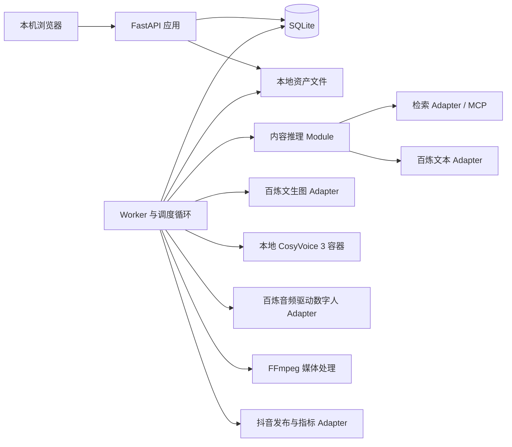
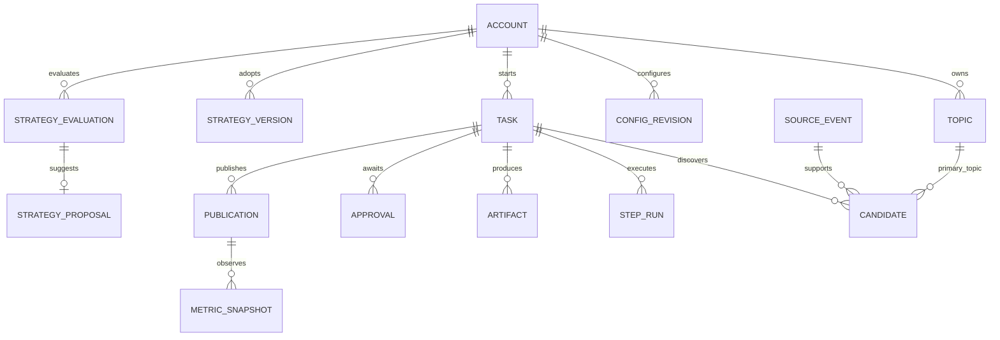
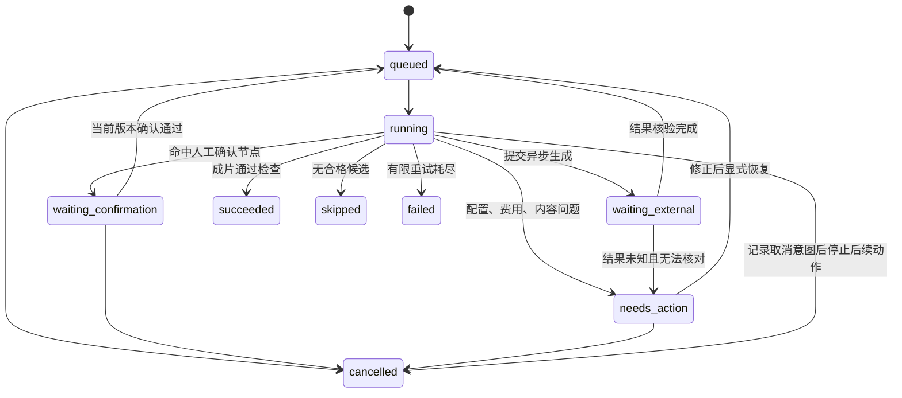
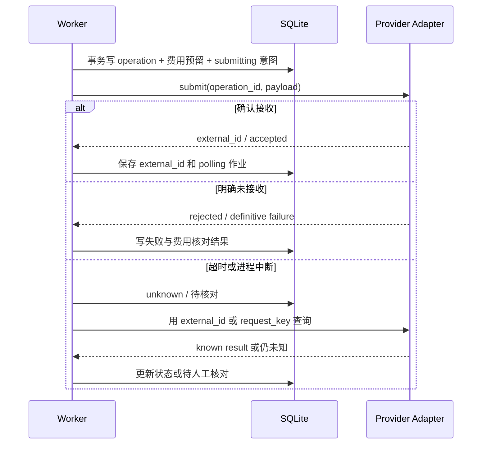

# 视频生成与运营闭环技术方案

版本：v0.1  
日期：2026-09-21  
需求基线：[PRD v0.35](视频生成平台PRD.md)  
业务术语：[CONTEXT.md](CONTEXT.md)  
实现顺序：[开发实施计划](开发实施计划.md)

## 1. 结论与设计范围

首期采用模块化单体：React 管理界面、FastAPI 应用、独立 Worker、SQLite 和本地文件存储。本地 CosyVoice 3 独立运行于 Linux GPU 容器，通过内部 HTTP 接口提供音色试听和配音。文本、文生图及音频驱动数字人通过百炼 Adapter 接入，发布和指标通过抖音 Adapter 接入。

持久化工作流管理任务、版本、人工确认、费用、重试和发布；deepagents 仅承担受约束的内容推理步骤。发布与数据反馈完成后不自动创建下一条视频，只有新的手动或定时触发才创建生产任务。

本文件完成设计，不代表代码、部署或外部调用已经完成。按三项核心接入能力技术可行的前提推进，不再阻塞需求定稿；具体端点、模型权限与性能在实施验证中固定，不编造供应商接口。下文标为“工程初值”的参数可根据实测调整，不能覆盖 PRD 中已确认的范围、费用上限及人工确认要求。

### 1.1 技术选择

| 层次 | 首期选择 | 理由与限制 |
| --- | --- | --- |
| 页面 | React + TypeScript + Vite，基础组件用 Ant Design | 表单、任务表格和预览为主，无需服务端渲染 |
| 应用 | Python 3.11 + FastAPI + Pydantic，SQLAlchemy 2 + Alembic | 复用 Python 模型工具生态，数据库变更可迁移 |
| 执行 | 同一代码库的独立 Worker 进程，数据库作业表 | 持久化等待与恢复，不依赖网页或 HTTP 长请求 |
| 数据 | SQLite，WAL、外键约束、短写事务 | 适合 Windows 单机单账号；暂不需要 Redis/Celery/PostgreSQL |
| 文件 | 本机文件系统，数据库保存资产元信息和校验值 | 原始素材与成片不塞进数据库 |
| 内容推理 | deepagents + 项目内容 Skills，Pydantic 输出校验 | Agent 无任务状态和发布权限的最终决定权 |
| 外部检索 | 一个 Search Adapter，优先验证 MCP 检索工具 | MCP 是连接方式，不是假定现成的热点数据产品 |
| 云端生成 | 百炼 Text/Image/Avatar Adapter | 实际模型 ID、地域和输入限制通过能力记录确定 |
| 配音 | CosyVoice 3，Python 3.10 独立环境，Linux GPU 容器 | 避免 CUDA/PyTorch 依赖污染应用环境；只运行一条 GPU 任务 |
| 媒体 | FFmpeg/ffprobe | 测时长、封装、字幕烧录、画布适配及基础质量检查 |
| 页面更新 | 首期 HTTP 轮询，活跃任务建议每 2 秒 | 减少 SSE/WebSocket 重连与事件回放实现；历史空闲页降低频率 |
| 验证 | pytest + 少量浏览器端到端测试 | 状态和并发测试是重点，真实模型测试单独执行并计费 |

依赖版本在首个实施阶段解析并锁定；本方案不假定任意版本的 deepagents、百炼 SDK 与 CosyVoice 可共用一个环境。

## 2. 运行拓扑与 Module 划分



API 与 Worker 是同一应用的两个进程，共享业务 Module 和 SQLite，不互相通过内部 HTTP 调业务。网络调用和媒体处理在事务外执行。TTS 单独进程是因 GPU 依赖隔离，不代表业务微服务化。

这里用 Module 表示一组完整业务行为，Interface 表示调用方必须遵守的输入、输出、状态与错误约束，Adapter 负责外部协议差异。Seam 设置在真实外部差异和测试替身之间，不为每个数据库表增加一层通用抽象。

| Module | 小范围 Interface | Implementation 隐藏的复杂性 |
| --- | --- | --- |
| accounts | `configure / read_config / set_gate` | 账号归属、配置版本、主题与实时确认开关 |
| production | `start / edit / confirm / retry / cancel / get` | 阶段流转、产物依赖、人工确认、恢复、作业创建 |
| content | `discover / draft / review` | MCP 检索、出处、事件合并、主主题判断、结构化 Agent 结果 |
| assets | `ingest / resolve / select_avatar / confirm_voice` | 文件校验、版本、来源、引用、试听状态和临时输出 |
| generation | `request_image / request_speech / request_avatar / reconcile` | 异步模型任务、供应商状态、音频格式、取消和结果未知 |
| media | `compose / inspect` | 音画对齐、字幕时间轴、720×1280、FFmpeg 错误和文件验证 |
| publishing | `plan / confirm / dispatch / reconcile` | 当前发布前置条件、过期、排期、结果核对及防重复 |
| analytics | `collect / summarize / evaluate / decide` | 指标缺失、24 小时窗口、中位数、建议去重和策略版本 |
| budget | `reserve / settle / release_verified / snapshot` | 总额与首轮额度、在途占用、账单延迟、精度及提醒 |
| runtime | `enqueue / claim / heartbeat / complete / recover` | 作业租约、调度记录、单实例执行和崩溃恢复 |

production 不直接拼供应商 HTTP 参数；publishing 不自行生成脚本；analytics 不修改运行中的生产任务。跨 Module 的写入由应用用例在单个短事务中协调，避免只更新一半状态。

### 2.1 deepagents、Skills、MCP 的位置

- 首期采用固定工作流中的三个逻辑内容角色：检索分析、口播稿生成、独立检查。总管的确定性执行职责由 production/runtime 承担，界面无需显示四个聊天机器人。
- deepagents 调用只能执行指定步骤，设置模型调用次数、工具调用次数和输出大小上限。它的 checkpoint 仅用于模型步骤恢复，不能替代业务数据库。
- 项目 Skills 分为 `topic-discovery`、`spoken-script`、`content-review`、`strategy-explanation`，记录领域规则、输入输出格式和示例；任务记录 Skill 内容哈希及版本。
- 检索角色仅获得只读 search/fetch 工具；写稿与检查获得经过整理的来源片段。不给模型任意 shell、数据库凭据、发布工具或预算修改工具。
- 检索网页作为不可信资料，不能指示 Agent 更换账号、调用发布或读取密钥。
- 所有模型输出需结构化校验；引用必须指向本次持有的来源 ID。账号相关性和检查原因可以由模型判断，排序、时间窗口、金额和档位变化用确定性代码验证。
- 第一次未产生合法输出可进行一次受预算约束的格式修正；仍失败转待处理。不能将 schema 失败无限重试成高额调用。

## 3. 数据结构与约束

所有时间以 UTC 保存，页面及每日配额按账号时区展示/计算，首期 `Asia/Shanghai`。ID 采用 UUID，枚举使用稳定英文值，界面显示中文。金额用人民币微元整数存储（1 元 = 1,000,000 微元），不使用浮点累加；这是内部预算精度，不冒充供应商账单精度。

### 3.1 主要关系



### 3.2 表与关键字段

下列是建议迁移模型，JSON 字段只放低查询频率的快照、提供方原始摘要或变动结构；关联键、状态、金额、到期时间不得只藏在 JSON 中。

| 表 | 关键字段与作用 |
| --- | --- |
| `accounts` | `id, name, timezone, current_config_id, current_strategy_id, control_revision, automation_paused` |
| `topics` | `id, account_id, name, keywords_json, enabled`；删除改停用，历史归属保留 |
| `account_configs` | `id, account_id, version, positioning, audience, exclusions_json, style, avatar_revision_id, voice_revision_id, freshness_days, min_duration_s, max_duration_s, width, height, lookback_days`；不可变配置版本 |
| `account_controls` | `account_id, topic_manual, script_manual, publication_manual, revision`；实时开关与普通配置快照分开 |
| `platform_bindings` | `id, account_id, platform, external_account_id, credential_ref, capability_revision, auth_status`；绑定改变不覆盖旧发布身份 |
| `schedules` | `id, account_id, enabled, local_time, timezone, next_fire_at, revision`；默认关闭 |
| `schedule_fires` | `schedule_id, revision, planned_at, discovered_at, result, task_id, reason`；记录已触发或错过 |
| `source_events` | `id, canonical_key, title, event_at, time_evidence_json, material_revision`；实际新进展可另建关联事件 |
| `source_documents` | `id, event_id, url, normalized_url, retrieved_at, published_at, excerpt, content_hash, heat_json` |
| `tasks` | `id, account_id, trigger, config_id, strategy_id, state, current_stage, revision, selected_candidate_id, created_at` |
| `candidates` | `id, task_id, account_id, event_id, main_topic_id, auxiliary_topics_json, angle, eligible, content_kind, reason, ranking_evidence_json, version` |
| `account_event_claims` | `account_id, event_id, task_id, state`；账号内选择事件时占位，取消未发布后经规则释放 |
| `script_revisions` | `id, task_id, version, text, sentences_json, claims_json, estimated_duration_s`；每项事实关联来源 |
| `step_runs` | `id, task_id, stage, input_fingerprint, attempt, state, output_artifact_ids_json, model_revision, skill_hash, error_code, started_at, ended_at` |
| `artifacts` | `id, account_id, task_id?, kind, revision, storage_key, sha256, size_bytes, metadata_json, source_json, created_at`；不可变实体 |
| `artifact_dependencies` | `parent_id, child_id`；追踪脚本、音色、音频、字幕与视频失效关系 |
| `voice_revisions` | `id, account_id, reference_artifact_id, transcript, model_id, model_revision, state, preview_artifact_id, confirmed_at` |
| `approvals` | `id, account_id, task_id?, gate, target_id, target_version, bundle_hash, control_revision, state, decided_at` |
| `publications` | `id, account_id, task_id, binding_id, artifact_id, metadata_revision, main_topic_id, main_topic_name_snapshot, mode, planned_at, actual_submitted_at, published_at, state, reason, freshness_override_id?` |
| `external_operations` | `id, account_id, owner_type, owner_id, provider, action, request_key, payload_hash, external_id?, state, last_polled_at, result_artifact_id?, redacted_response` |
| `metric_snapshots` | `id, account_id, publication_id, external_post_id, observed_at, provider_as_of?, provider_schema_version, values_json, availability_json, data_fingerprint` |
| `observation_assignments` | `publication_id, metric, window_hours, snapshot_id, actual_age_s, quality, assignment_revision`；确定用于比较的 24 小时观测 |
| `strategy_evaluations` | `id, account_id, trigger, local_day, evaluated_at, dataset_fingerprint, config_id, base_strategy_id, result, evidence_json` |
| `strategy_proposals` | `id, evaluation_id, account_id, state, changes_json, evidence_fingerprint, base_strategy_id, config_id, replaced_by?` |
| `strategy_versions` | `id, account_id, version, priorities_json, proposal_id?, restored_from_id?, confirmed_at`；所有版本不可变 |
| `budget_campaigns` | `id, limit_microyuan, warning_microyuan, phase, phase_limit_microyuan, state`；200/160/50 元 |
| `cost_entries` | `id, campaign_id, operation_id, phase, estimated_microyuan, reserved_microyuan, actual_microyuan?, state, pricing_revision` |
| `jobs` | `id, kind, aggregate_id, dedup_key, input_revision, run_after, status, lease_owner?, lease_until?, fence, attempts, reason` |
| `audit_events` | `id, account_id?, task_id?, action, target_id, before_revision?, after_revision?, occurred_at, actor, detail_json` |

首期表较多但只有一份数据库；内容产物和动作记录分开是为了防止“编辑一次覆盖全部历史”和重复计费，Implementation 可按上述 Module 分组，不创建每表一套业务 Module。

### 3.3 必须由数据库或事务保证的不变量

1. `UNIQUE(schedule_id, revision, planned_at)`；`UNIQUE(account_id, client_request_key)` 保存手动触发幂等键，相同键不同 payload 返回冲突。
2. `UNIQUE(provider, request_key)`；同一 external operation 的预算记录唯一；网络请求不在数据库事务内。
3. `UNIQUE(jobs.dedup_key)`；相同逻辑步骤可以有多个 attempt，但不能有两个当前活跃 attempt。
4. 每条 candidate 有且仅有一个 `main_topic_id`；账号归属在用例层校验并以 `(id, account_id)` 复合外键约束任务、主题、策略和发布记录。
5. 每个账号最多一份 `pending` 策略建议，用部分唯一索引保证；自动评估的 `(account_id, local_day)` 单独唯一，手动评估不受该索引限制。
6. 每个账号每个事件最多一个有效占位。占位在采用选题时产生；已发布的不释放，取消且没有未知发布请求才可释放。
7. 普通发布对 `(binding_id, task_id, artifact_id, metadata_revision, edition=1)` 唯一。显式再发布建立新 edition，不能靠重试创建第二条发布意图。
8. 更新确认、取消、策略和模式时使用 `expected_revision` 比较并加一；内容已被其他操作改变时返回 409，不能以旧页面确认新内容。
9. 快照只追加，主主题统计按作品归属，不能把多个来源命中、多次采集或辅助主题当成新增作品样本。

## 4. 生产状态机与版本一致性

### 4.1 阶段与状态分离

`task.state`：`queued / running / waiting_confirmation / waiting_external / needs_action / succeeded / skipped / failed / cancelled`。

`task.current_stage`：`discover / select / draft / script_review / synthesize / avatar / compose / final_review / done`。同一状态可以发生在不同阶段，错误与原因单独编码。`succeeded` 只表示成片通过检查，发布和指标另有状态。



外部操作可在任务 cancelled 后完成，仍核对结果和费用、保留产物，不自动继续到成片或发布。一个生产任务等待外部结果或人工操作时不占用 Worker 的调度循环。

### 4.2 一次完整执行

1. 创建任务：绑定账号配置、当前策略、形象和音色版本，验证可运行项；账号未接入抖音可运行素材验证/生产预览，发布会明确待配置。
2. 检索并保存资料；合并事件，应用相关性、时间、排除、事实依据和去重规则。候选无合格项则 skipped，不能无限补产。
3. 确定主主题；合格热点优先，其内主主题 `high > medium > low`，同档再比较来源可比的热度及事件时间。没有热点才切到资讯候选。
4. 工程初值：同一热度来源与口径内按热度降序、事件时间降序、候选 ID 稳定排序；无法比较来源热度时按事件时间排序并展示原因，绝不相加不同来源数值。此初值不改变已确认的跨档顺序。
5. 选题需人工时挂起，否则采用并占位；生成稿、检查稿、必要的有限修正；稿需人工时挂起。
6. 用已确认音色合成配音；测实际音频长度，超范围则生成新脚本版本并重新检查/确认，不偷偷改变已确认稿。
7. 提交形象＋音频到 Avatar Adapter，查询完成后取回视频；完成画布、字幕、最终音轨合成与检查。
8. 生产完成后建立唯一发布记录；根据发布确认开关、排期和实时安全约束决定等待或提交。
9. 平台确认发布后采集指标；评估建议，人工确认策略；等待新生产触发。

### 4.3 普通配置快照与实时控制

任务固定账号定位、形象、音色、输出规格、选题时效规则及策略版本。自动化暂停、预算可用量、凭据有效性和人工确认开关在每个节点继续前读取当前值。

| 操作 | 影响 |
| --- | --- |
| 修改主题定位、时长、形象、音色 | 默认只影响新任务；已有任务显式应用时生成新修订 |
| 自动改人工 | 未越过该确认节点的任务必须检查当前人工确认；已发出的外部请求继续核对 |
| 选题/脚本人工改自动 | 历史待确认项不放行；之后新到达该节点的任务自动继续 |
| 发布人工改自动 | 仅切换后创建的任务默认采用新模式；历史待确认发布逐条处理，保留 PRD 中更严格的规则 |
| 修改脚本 | 作废脚本确认，音频、字幕、视频和成片检查均失效 |
| 修改音色 | 脚本可复用，音频及下游失效 |
| 修改形象 | 脚本和音频可复用，视频及成片检查失效 |
| 修改标题/标签 | 视频可复用，发布信息检查与发布确认失效 |
| 应用新时效范围至过期任务 | 写入独立规则修订及操作者，复查内容；不覆盖旧配置快照 |

确认的 `bundle_hash` 包含准确的产物版本和发布信息；节点通过前事务检查 `expected_revision`、开关和 hash，关闭人工开关也不能绕过内容检查失败。

## 5. 调度、异步调用与失败恢复

### 5.1 Worker 结构

首期一个 Worker 实例、一个生产执行槽、一个 GPU 槽；调度和网络查询为短任务循环，媒体/模型工作在受限 executor 或外部进程内执行。GPU 推理不阻塞发布排期、状态核对或指标采集。素材试听与正式配音共享 GPU 槽。

作业类型为 `advance_task / poll_operation / compose_video / dispatch_publication / collect_metrics / evaluate_strategy / reconcile_cost / reconcile_schedule`。HTTP 处理只校验和写入意图及作业，返回 202；禁止用 FastAPI BackgroundTasks 承担需跨重启恢复的业务。

SQLite 设置 `foreign_keys=ON, journal_mode=WAL, busy_timeout`；claim 用短 `BEGIN IMMEDIATE` 事务，选取到期 queued 作业、增加 fence 并写 lease，提交后执行。工程初值心跳 5 秒、租约 30 秒，任务长于租约时持续续租。

租约/fence 保证陈旧 Worker 不能提交数据库结果，但不能阻止它已发送的外部请求。启动脚本还需单实例 Worker 锁；发现旧实例存活时不得接管并再发请求。接管状态为 submitting 的 external operation 必须进入核对，不因租约过期就自动重提。

### 5.2 外部动作的可靠提交



不能承诺外部 API 的“恰好执行一次”：只有提供方支持幂等键时才可使用同键安全重提；不支持且无法查询的提交未知必须待人工核对。图像、数字人等付费生成也遵循该规则，不仅是发布。已经保存可用结果时优先复用，按输入指纹防止内容已变时误用缓存。

建议错误分类：`retryable_transport`、`rate_limited`、`auth_required`、`invalid_input`、`policy_rejected`、`budget_blocked`、`resource_exhausted`、`submission_unknown`、`content_expired`、`stale_revision`。确定无外部副作用的瞬态失败最多自动重试 2 次；429 遵守 retry-after。超时默认值来自能力配置，不以 HTTP 超时等价于外部任务失败。

### 5.3 生产计划与发布计划

- 定时生产默认关闭，开启后每日指定时间一次；`schedule_fires` 持久化每个计划时刻的处理结果。
- 工程初值调度 tick 为 1 秒，允许 30 秒处理容差，启动/休眠恢复时补登记错过记录；超过容差的生产计划记录 missed，不创建补跑任务。容差是调度误差控制，不是允许长期补产。
- 修改计划增加 revision；旧 revision 的 queued 触发作业执行前失效。提前改表时间不能导致同一计划重复创建任务。
- 发布到时仍不具备检查/人工确认/预算等条件，按 PRD 转 needs_action，不在后来完成时自行补发。30 秒容差只处理调度抖动，已标记 missed 的记录必须用户选择。
- 进入待确认的发布保留原因和计划时间，能显示“待确认且已错过时间”，不让单一状态遮蔽第二个阻塞原因。
- 恢复时先核对已有外部动作，再恢复持久化任务，最后计算下一个未来计划时间；已取消、暂停或过期的任务不会随重启复活。

## 6. 外部 Adapter 与音视频链路

以下均为项目内部 Interface，**不是百炼、CosyVoice 或抖音官方端点承诺**。实现阶段用实际官方请求映射，供应商特有字段只出现在 Adapter 内。

### 6.1 类型化契约

| Interface | 输入 | 输出及约束 |
| --- | --- | --- |
| `Search.search` | 主题关键词、时间范围、数量上限 | 来源链接、事件时间证据、摘要、可选热度值及口径；不保证每次返回热点 |
| `Text.generate` | 任务模板、资料片段、目标 JSON schema、模型 ID | 校验后结构化结果、用量及模型版本；实际付费调用经过预算入口 |
| `Image.submit/query` | 描述、尺寸约束、request_key | 异步 Operation 或图片资产；生成新图不自动切换账号形象 |
| `Speech.preview/synthesize/query` | 已确认音色版本、目标文本/句段、request_key | job_id、WAV、采样率/声道/时长、句段时间轴；不宣称返回逐字时间戳 |
| `Avatar.submit/query` | 形象资产、已确定配音资产、目标规格、request_key | 外部任务状态与视频；必须保留提供的配音内容和音色 |
| `Douyin.publish/reconcile` | 平台绑定、成片、元信息、合成标识、request_key | external_post_id、平台处理/发布/拒绝/未知状态及发布时间 |
| `Douyin.metrics` | 作品标识 | values + 每字段 availability + observed_at/provider_as_of；缺失不能伪装成 0 |
| `MediaTransfer.prepare/revoke` | 本地资产 ID、目标提供方、有效期 | 可上传文件或可访问临时地址；不暴露本地盘符路径 |

统一 Operation 返回 `accepted / running / succeeded / failed / unknown`，带 provider、external_id、error_code、result 和 cost_evidence。业务发布状态仍由 publishing 根据提供方含义映射，accepted 不等于已发布。

### 6.2 本地 CosyVoice 3

使用 [已核验调研](CosyVoice3接入调研.md)中的 `FunAudioLLM/Fun-CosyVoice3-0.5B-2512` 作为首个候选，固定权重版本及代码提交。Python 3.10、PyTorch/CUDA 组合在容器构建中锁定；主应用 Python 3.11 不导入其依赖。初始不用 TensorRT/vLLM 等额外优化，先串行验证。

本地封装提供 `GET /health`、`POST /v1/voices/preview`、`POST /v1/speech/jobs`、`GET /v1/speech/jobs/{id}`；接口由项目实现。使用 request_key 在 TTS 本地作业日志持久化结果映射，重启时标记中断作业，已有输出可按校验复用。

音色请求包含参考 WAV 资产和准确转写文字；当前路径要求参考音频不超过 30 秒。检查可解码、非空、时长及有声部分，提示单人清晰录音质量建议，不能把音频自动转写当成已具备的功能。试听经用户确认后保存 voice revision，CosyVoice 的 speaker ID 是可重建缓存，不是唯一业务原始数据。

输出按实际模型采样率生成 WAV（当前候选 24 kHz），明确 PCM 数据类型和 WAV 封装。官方 FastAPI 原始 PCM 流不能直接以 `.wav` 后缀保存使用。请求正文不接收任意宿主机路径，由资产 ID 映射到受控挂载位置。

### 6.3 字幕同步的首期实现

CosyVoice 的声音输出不自动等于准确字幕时间轴。首期采用**按句段合成、测量音频、拼接并记录时间轴**：

1. 将最终已确认脚本切成可读短句段，保存不丢词的 `segments[{id,text}]`；显示文本与发音规范化文本分别保存。
2. 依次调用同一音色和模型生成各段，测量每段实际采样数；拼接时保留明确的段间停顿，并累加得到真实起止时间。
3. 每个字幕 cue 对应一个音频段，可在 cue 内换行；默认字幕样式以双行可读为目标。需要更细字幕时先调整句段再合成，不能按整片时长均分字符。
4. WAV、cue JSON、SRT/ASS 作为独立资产保存；合并后的**同一音频**送给数字人服务，最终合成不重新配音。
5. 句段拼接可能影响自然度，纳入试听验收；若效果不合格再评估整段合成＋强制对齐方案，不先添加另一个 GPU 大模型。

音频总时长需满足 30～60 秒。超出则有限改稿并重新确认，不强制截断话尾。视频长度与音频存在误差时先测量：工程初值超过 200ms 转待处理，不能用速度拉伸掩盖口型漂移；小幅尾部差异可补齐尾帧，最终仍需目视抽检。阈值是工程起点，可按供应商输出帧率校准。

### 6.4 数字人及最终合成

- 选定形象、WAV 和默认竖屏配置经 Adapter 提交。若供应商每次时长限制不足整条口播，在句段处切分并保持同一形象/配置；只有验证拼接连续性和口型通过后才采用，不默认宣称支持任意长度。
- 云端需要 URL 时优先使用提供方正式上传能力；否则使用经配置的对象存储临时地址。额外存储费用单独记录，不在文档中假定已开通公网服务。
- 生成文件先保存临时路径，经 ffprobe/校验后原子重命名，再提交资产记录；作业崩溃留下的临时文件可清理，已被任务引用的文件不可删除。
- FFmpeg 输出工程初值为 MP4、H.264、yuv420p、AAC，画布 720×1280。编码参数以实际抖音接入限制核验；不变更已确认竖屏尺寸。
- 保持人物比例，用 pad/contain 适配，避免裁掉嘴部；不做额外背景生成、素材插入和转场。字幕烧录、固定模板、预置可用中文字体。
- 检查可解码、音视频流、实际尺寸/时长、字幕边界及全片黑屏/无声。黑场和静音检测仅对整片明显失败给硬阻断，普通停顿不当作违规。口型仍依照 PRD 抽查，不声称算法已完成高精度评分。

## 7. 发布执行的最后一道检查

发布意图先准备上传文件，再在**真正创建可发布作品的请求发出前**检查：账号绑定及授权、任务取消/暂停状态、当前人工确认规则、bundle_hash、成片检查、时效窗口、排期、合成内容标识和幂等键。

时效使用任务记录的规则与当前时刻；普通账号配置更改不会静默扩大旧任务范围。用户显式把新时效范围应用于过期任务时另存 revision，重新检查。HTTP 延迟/平台审核时间不等于提交前过期；已提交任务继续核对，不自动删除或重发。

`publication.state` 建议值：`awaiting_confirmation / scheduled / ready / needs_action / submitting / platform_processing / published / rejected / unknown / cancelled`，阻塞原因可多项，例如 `expired + missed_schedule`。指定时间已过且未提交的记录不能因重启自动转 ready。

发布执行前有短事务比较最新 revision 并写 submitting，提交网络请求前再次检查取消标识；若暂停操作到达时请求已经发送，界面如实说明“已发出，继续核对”，不承诺强制撤回。callback 若未来启用，验签、关联 operation、去重后仅触发核对；首期优先轮询以减少本机公网回调依赖。

## 8. 指标、策略和费用

### 8.1 指标契约与 24 小时观测

```json
{
  "publication_id": "pub_uuid",
  "observed_at": "2026-09-22T01:00:00Z",
  "provider_as_of": null,
  "values": {"plays": 0, "likes": 0, "favorites": null},
  "availability": {"plays": "available", "likes": "available", "favorites": "unsupported"}
}
```

availability 使用 `available / unsupported / not_ready / failed`；null 不是 0。采集失败记录 attempt 错误，不伪造成功快照。累计值因提供方修正而下降时保留真实值及异常标记，不强制单调。

优先使用提供方明确的 24 小时统计。只有累计快照时，工程初值取实际发布后 `[24h,25h]` 内最早成功快照，显示真实观察年龄与偏差；这个 1 小时容差在接入验证时核准，不能把它隐藏称为精确 24h 数据。未命中则标缺失，不用更晚累计值补造。

建议每小时采集，另外为 published_at+24h 建立目标采样作业；前 48 小时保持较密采样，之后至 30 天可降为每日一次，作为工程初值控制配额。电脑停机错过窗口不回填；若平台提供历史窗口结果则可以读取，仍记录取得时间及提供方统计期。

每次汇总以 `as_of` 选取最近 30 天真实发布的作品，按唯一主主题归组、每个作品一个有效 24h 观测计算 median。未满窗口的作品不混入正式中位数。没有可读播放量时主要指标 unavailable，不能自行改成曝光量。

### 8.2 评估和策略确认

数据指纹含有效观测的版本、当前回看范围、主题配置和基础策略版本；纯采集时间变化不触发新分析。新的真实零值、指标修正或首次进入 24h 可用窗口属于新信息。即使数值不变，作品首次有合格 24h 观测也需更新资格。

自动评估以账号本地自然日唯一记录，每天最多一次，有新数据且没有当前待确认建议时入队。任务失败只在同一 evaluation 下有限重试，不创建第二个自动评估名额。回看范围随时间滑动，手动评估应依据当时真实样本集重新求 fingerprint；自动评估仍需满足新增有效指标条件。

模型只提出受限 JSON：主题 ID、旧档、新档、证据引用、exploratory 标识、原因；确定性代码验证主题归属、仍启用、相邻档位、当前 base_strategy_version 和预算。低样本、未满窗口全部标为探索；初期对推断采用保守探索标签，不宣称统计显著。

同一账号最多一份 pending proposal。已拒绝建议在同一数据依据下不重建；新数据来临可以提示重新评估，不直接覆盖。手动替代旧建议在一个事务内标 replaced 并建立新建议，或保存“保持不变”结果，确认和替代并发时以 revision 决定唯一成功者。

批准在一个事务内检查建议未过时、创建不可变策略版本、切换账号 current_strategy_id、写审计记录。重复 approve 返回既有结果，不再次升降。回滚创建记录其来源的新版本，不复用旧版本号以绕过并发校验；不会自动生产下一条视频。

### 8.3 预算账本

所有实际付费调用，包括文本推理、检查重写、文生图、数字人和付费检索，统一经过调用入口。声明存在但没有计价配置的付费 Adapter 不得直接发请求。

可用额 = 限额 − 已记实际/估算费用 − 在途预留（同一 operation 只占一份，不能估算和预留双计）。预留事务同时检查 200 元 campaign 和当前首轮 50 元 phase，按本次可支持的保守费用上界占用；LLM 请求限制最大输出 token，视频按时长单位估算，含失败重试的新调用重新预留。

原子写入 `cost_entry + external_operation + job 状态` 后才调用。结果返回用提供方实报替换预估/预留，unknown 保留占用；确定未计费才释放。实际超出估算时如实记账并冻结新增付费动作，不篡改成上限内。API 账单延迟意味着只能保证提交前的预算策略，不能保证供应商账单绝对封顶。

160 元费用提醒及包含在途预留的提前提醒分别展示，提醒去重。首轮结束必须用户显式操作，不能达到 50 元就自动解锁余下预算。系统重启、日期切换、取消任务不重置账本。本地 TTS 记录算力耗时，不计云端 TTS 调用费。

## 9. HTTP Interface 与页面交互

业务接口均以 `/api/v1` 为前缀。变更请求携带 `Idempotency-Key`，已有资源动作包含 `expected_revision`；401 为未授权本机会话，409 为过时版本/幂等冲突，422 为输入错误，503 为依赖未就绪。预算不足作为结构化业务错误 `BUDGET_BLOCKED`，异步结果通过资源状态读取。

| 路径 | 动作与关键输入 |
| --- | --- |
| `GET /system/status` | API/Worker/TTS/提供方配置、预算、模式摘要；不泄露密钥 |
| `GET/PATCH /accounts/{id}/config` | 读取配置、提交新配置版本 |
| `POST /accounts/{id}/topics`、`PATCH /topics/{id}` | 主题新增、编辑、停用，初始中档 |
| `PATCH /accounts/{id}/controls` | 三个人工开关与暂停控制，明确影响范围 |
| `PUT /accounts/{id}/schedule` | enabled/local_time/timezone，返回 next_fire_at |
| `POST /assets` | 文件上传，返回 asset_id；不接收本地任意路径 |
| `POST /accounts/{id}/avatar-generations` | prompt → 异步文生图任务；GET 查询结果 |
| `POST /accounts/{id}/avatar-selection` | 显式选择某图片版本 |
| `POST /accounts/{id}/voices` | reference_asset_id/transcript/source → 草稿音色 |
| `POST /voices/{id}/preview`、`POST /voices/{id}/confirm` | 试听作业与音色确认，不受三个生产开关控制 |
| `POST /accounts/{id}/tasks` | 一次生产；可指定手动主题；返回 202 + task_id |
| `GET /tasks`、`GET /tasks/{id}` | 状态、候选、产物、确认项、费用和原因 |
| `POST /tasks/{id}/topic-selection` | candidate_id/main_topic_id，确认前可选其他合格候选 |
| `POST /tasks/{id}/script-revisions` | 修改文本产生版本，返回被作废的下游产物列表 |
| `POST /approvals/{id}/decision` | approve/reject，准确 target_version/bundle_hash |
| `POST /tasks/{id}/retry`、`POST /tasks/{id}/cancel` | 从可恢复步骤继续或取消后续动作 |
| `POST /tasks/{id}/publications` | mode、planned_at、标题/标签等，创建唯一发布意图 |
| `POST /publications/{id}/resolve` | publish_now/reschedule/apply_freshness_config；需 expected_revision |
| `POST /publications/{id}/reconcile` | 仅核对已有提交，不是再发布 |
| `GET /accounts/{id}/analytics` | 主题中位数、窗口、样本、缺失数、作品列表 |
| `POST /accounts/{id}/evaluations` | 手动评估，返回新 evaluation 或已有结果 |
| `POST /strategy-proposals/{id}/decision` | approve/reject；过时建议 409 |
| `POST /accounts/{id}/strategy-rollbacks` | source_version_id，创建恢复版本 |
| `GET /budget`、`POST /budget/finish-validation` | 费用与预留、显式结束首轮验证 |
| `GET /assets/{id}/content` | 受控预览下载，视频支持 Range |

任务创建例（示意 UUID，不是可执行的实际请求）：

```json
{
  "expected_config_revision": 3,
  "trigger": "manual",
  "publication": {"mode": "immediate", "planned_at": null}
}
```

响应展示 `config_version`、`strategy_version`、当前阶段、`blocking_reasons[]`、`next_actions[]`；页面不按状态名称自行推断哪些动作合法。未知 external operation 提供“核对”动作，不能将普通“重试”按钮直接绑定重新提交。

页面保持 PRD 三组：配置（含形象/音色）、任务及详情、运营概览。首次进入展示尚未配置项及首个测试账号模板，模板不会替用户创建抖音账号或开放平台应用。

## 10. Windows 部署、文件与运行参数

建议主应用与 Worker 在 Windows Python 虚拟环境运行；前端构建后由 API 提供静态文件。TTS 通过 Docker Desktop WSL2 Linux 容器运行。首期不把 SQLite 放入跨 Windows/容器的共享数据库目录；两个写数据库进程都在同一 Windows 文件系统内。

根目录项目内容仅保留 `docs/`、`backend/`、`frontend/`、`scripts/`、`data/`、`config/` 六个文件夹，隐藏的 `.git/` 为版本管理元数据。当前已建立目录骨架并归档文档，空目录使用 `.gitkeep` 保存；以下应用文件仍为规划，尚未编写代码或配置，实际布局见 [项目目录](项目目录.md)：

```text
docs/{CONTEXT.md,视频生成专题.md,视频生成平台PRD.md,技术方案.md,开发实施计划.md,项目目录.md,CosyVoice3接入调研.md}
backend/
  app/{main,worker,config,db,models,accounts,workflow,agents,context,assets,media,publishing,analytics,budget}.py
  app/providers/{bailian,cosyvoice,douyin,search,transfer}.py
  migrations/
  tests/
  fonts/
  tts/{Dockerfile,compose.yaml,server.py,engine.py,requirements.lock}
  skills/{topic-discovery,spoken-script,content-review,strategy-explanation}/
frontend/src/{pages,components}/
frontend/src/{main.tsx,App.tsx,api.ts}
frontend/tests/
scripts/{start.ps1,stop.ps1,status.ps1,backup.ps1,restore.ps1}
data/{app.db,assets,models,checkpoints,tmp,tts-state,logs,backups}/
config/{config.example.yaml,.env.example}
```

上述为简化后的物理布局：第 2 节的 Module 仍表示逻辑职责。production 对应 `workflow.py`，runtime 对应 `worker.py`，content 对应 `agents.py` 与 `context.py`；generation 的执行和结果核对由工作流、Worker 与 providers 协作完成，其余业务职责放在同名文件。后续按代码规模拆分目录。

主 API 工程初值 `127.0.0.1:8000`；TTS 映射 `127.0.0.1:8001`，内部共享密钥保护，模型挂载只读，TTS 只写自己的状态和音频出口。启动用隐藏后台进程并保存 PID/启动标识；停止仅针对本项目进程，不关闭其他 Docker 容器或 GPU 工作负载。

启动次序：目录与依赖检查 → DB 迁移/单实例检查 → TTS 健康检查（失败可进入仅配置模式）→ API → Worker → 状态汇总。浏览器关闭不终止后台进程；电脑关机/休眠时暂停，恢复遵守既定 missed 规则。

提供方配置只存 credential_ref；开发可使用被忽略的本地环境文件，令牌在服务端保存并脱敏。限定本机 Origin/Host，变更接口用本机会话令牌和 CSRF 防护，CORS 不设通配符。以后远程访问另加认证与 TLS，不默认将 TTS 或文件目录暴露公网。

已知机器 GPU 报告约 12GB 总显存，先前瞬时可用约 4.5GB；这只是环境记录，部署时重新测量并验证 GPU 透传。模型下载和本地依赖安装属于实施阶段，不包含在本次文档交付。

工程初值：主日志滚动保留 14 天，临时未引用文件保留 7 天；原始音色、形象、确认产物、发布记录和策略依据首期不自动删除。启动前检查可用磁盘，低于可配置阈值停止新媒体任务，不能先删正在使用的素材。备份 SQLite 使用在线 backup 接口或停止写入后备份，不单独复制运行中的 `app.db` 忽略 WAL；备份含资产清单及哈希，密钥独立处理。

## 11. 验证策略与开发出口

开发测试只通过 Module 的 Interface 验证业务行为：使用受控时钟、提供方 Adapter 替身和实际临时 SQLite，重现未知响应、崩溃窗口、预算竞争和过时确认。模拟 Adapter 与真实 Adapter 共用同一 Interface；模拟模式显著标记，不能产生正式验收记录。

重点验证：

1. 两次相同按钮提交只创建一个任务/发布；两个费用申请并发不会超分配剩余额度。
2. 供应商已接收、数据库尚未写 external_id 时崩溃，恢复后进入 unknown/reconcile，不自动重提。
3. 确认与修改脚本并发只能一方成功；已确认旧版本不能放行新产物。
4. 关机错过生产不补跑、错过发布转待处理；已有外部任务结果仍核对。
5. 同一作品多快照、多辅助主题不重复计数；30 天回看与 24 小时观测正确分离。
6. 相同数据不重复建议、手动确认只升降一档、策略生效不触发新任务。
7. 真人试听确认后音色可跨重启复用，字幕基于实际音频段，最终音频与口型视频衔接。

真实调用按首轮 50 元阶段验证文本、图像、本地克隆音频、数字人口型和成本；完整闭环使用抖音真实作品标识和真实指标。抖音账号准备期间可完成前述独立 Module 和合同测试，不把导出视频或模拟发布计为完成真实闭环。

实施阶段能力记录至少包含：适配能力、模型/端点及版本、必要权限、输入限制、幂等与查询支持、费用来源、错误语义、一次实际结果。记录模板与 PRD 验收映射见 [开发实施计划](开发实施计划.md)。
