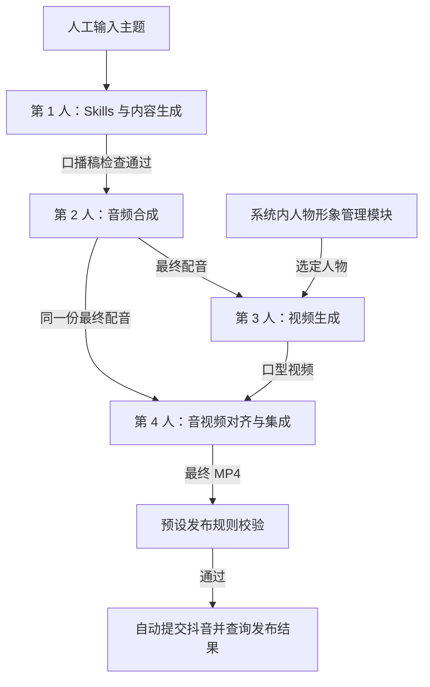

# 视频生成与自动发布技术框架

日期：2026-09-21

状态：整理中，已确认内容如下，剩余问题逐项澄清。

依据：用户提供的四人分工图片、[项目目录](项目目录.md)，以及本次逐项确认。当前已提供本机 API、Worker 与媒体环境自检页面，详见 [本机运行](本机运行.md)；下述真实生产与发布能力仍待接入。

## 1. 范围与流程

人工输入主题，系统依次生成口播稿、配音、口型视频和最终 MP4，按人工预先整理的规则自动发布到抖音。交付范围到发布结果确认，不包含发布后的运营数据监控和策略优化。

**本版目标：打通一条真实链路，将一条生成的视频上传并发布到抖音，保存平台返回结果。** 首次交付围绕这一条视频验证，不以连续生产或多任务调度为目标。

口播稿按预设规则自动检查，通过后进入配音和视频制作；不设置逐条人工确认发布。检查及返工规则由视频生成环节内部处理，本文不展开。成片不生成、不添加字幕。

发布标题和话题标签由第 1 人的内容模块根据主题和口播稿自动生成，随内容结果交给第 4 人的发布模块，经预设发布规则校验后用于抖音提交。

发布规则由专人整理为 `config/` 下的配置文件，系统读取并执行，第 4 人负责接入校验逻辑。本版不提供规则编辑页面；具体规则内容由维护人员提供，配置文件格式与字段在接口实施时确定。

四个模块在同一台本地电脑上运行，通过本地 HTTP 接口对接。视频时长、横竖屏、分辨率由第 3 人确定，与第 4 人对接。

独立 Worker 顺序执行这一条任务的内容生成、配音、口型视频、音视频集成和发布。保留任务状态与失败原因，支持单条链路联调；多任务排队、并发生产以及发布等待期间启动下一条任务均留到后续版本，本版不设计这些调度规则。

## 2. 四人分工

| 人员 | 职责 | 输入 → 输出 |
| --- | --- | --- |
| 第 1 人：Skills 与内容生成 | 维护写稿、检查、改稿 Skills；接入 deepagents 和百炼平台文本 API，自动生成发布标题和话题标签，具体模型通过配置选择 | 主题／修改意见 → 最终口播稿、发布标题、话题标签 |
| 第 2 人：音频合成 | 决定 TTS 和音色方案，调整发音与停顿，规范音频格式，测量实际时长 | 口播稿 → 最终配音 |
| 第 3 人：视频生成 | 决定数字人模型或服务及输出规格，接收选定人物与最终配音，处理视频生成和状态查询 | 人物＋最终配音 → 口型视频 |
| 第 4 人：音视频对齐与集成（用户本人） | 检查音画起点和时长、合并音轨、封装输出；串联流程、保存产物、处理失败恢复；负责抖音发布规则校验、提交与结果查询 | 配音＋口型视频 → 最终 MP4 → 抖音发布结果 |

**口型同步属于第 3 人的视频生成职责。第 4 人负责音轨与画面的时间同步、封装和验证。人物嘴型本身与语音不匹配时，交回第 3 人处理，后期移轴不能修复嘴部动作。**

人物形象作为系统内模块，由专人维护、核对和选定。专人与四人开发分工的对应关系尚未指定。音色管理暂不展开，由第 2 人决定音色方案。

## 3. 已确认技术选型

| 部分 | 选择 | 用途 |
| --- | --- | --- |
| 后端 | Python + FastAPI | 接收主题、管理人物形象、查询任务及发布状态 |
| 执行 | 独立 Worker 进程，顺序执行单条任务 | 串联这一条视频的生成、合成和发布，关闭页面后继续执行 |
| 前端 | React + TypeScript + Vite + Ant Design | 主题输入、人物形象管理、任务进度、成片预览、发布结果 |
| 业务存储 | SQLite | 任务、执行状态、人物资料、发布记录 |
| 文件存储 | 本地文件目录 | 人物图片、配音、口型视频和最终 MP4 |
| 媒体处理 | FFmpeg + ffprobe | 检查音画起点与时长、合并最终配音、封装 MP4 |
| 模块间通信 | 本地 HTTP 接口 | 前三人的模块独立开发，由 Worker 顺序调用 |
| 内容生成 | deepagents + Skills + 百炼平台文本 API，预留模型配置 | 写稿、检查和改稿 |
| 配音与数字人 | 分别由第 2、3 人选型 | 本文不指定供应商、模型或运行环境 |

本次确定的模块对接方式为本地 HTTP；未将 MCP 列为必需组件。依赖基线采用 Python 3.11、Node.js 22，直接依赖和间接依赖已通过清单及锁文件管理，见 [依赖与环境](依赖与环境.md)。本机启动入口已实现，当前用于环境自检。

### 文本模型接入与配置

已确认允许调用百炼平台 API。本地运行指应用和集成流程在本机运行，文本推理可由云端完成。具体模型尚未固定，通过配置切换，由第 1 人负责接入与能力验证。

预留以下服务端配置，字段名称为项目内部约定，不是百炼官方参数名称：

| 配置 | 用途 |
| --- | --- |
| `base_url` | 百炼接口基础地址，根据实际接入地域和协议配置 |
| `model` | 实际使用的文本模型 ID，不在业务代码中写死 |
| `api_key_env` | 提供 API Key 的环境变量名称；密钥只在本机服务端保存，不进入前端或版本库 |
| `timeout_seconds` | 请求超时时间 |
| `generation_options` | 模型支持的生成参数，由适配层校验后传入 |

写稿、检查和改稿允许分别配置模型，各自使用上述配置结构：

| 配置分组 | 对应步骤 |
| --- | --- |
| `text_models.writing` | 根据主题生成口播稿、发布标题和话题标签 |
| `text_models.review` | 按预设规则检查稿件 |
| `text_models.revision` | 根据修改意见或检查结果改稿 |

三个分组可选用相同或不同的百炼模型，分别设置接口地址、模型 ID、密钥环境变量、超时和生成参数，也可引用同一个密钥环境变量。具体型号、参数和接入能力由第 1 人验证，本文不预设价格或能力。

配置模板放在 `config/`，实际模型、地址与凭据在实施接入时填写。此处只记录配置设计，尚未创建配置文件或发起 API 调用。

### 配音与数字人服务配置

已确认：配音模型及音色方案由第 2 人决定，数字人模型或服务由第 3 人决定。两人分别通过本地 HTTP 接口交付能力，第 4 人的集成端只预留服务连接配置，不直接管理这两个模块内部的模型选择或供应商凭据。

| 配置分组 | 对接模块 | 负责提供接口 |
| --- | --- | --- |
| `services.speech` | 音频合成 | 第 2 人 |
| `services.video` | 口型视频生成 | 第 3 人 |

各组预留服务基础地址、请求超时时间、状态查询间隔，以及服务需要鉴权时的凭据环境变量引用。字段名称及具体取值在接口联调时确定。提交、查询与产物返回遵循下一节的 HTTP 交接约定，具体接口路径尚待共同确定。

## 4. 模块调用与交接

前三位负责人分别提供内容生成、音频合成和视频生成 HTTP 接口。耗时调用先返回任务编号，Worker 通过查询接口获取执行状态和产物。

| 模块 | 接收内容 | 交付内容 |
| --- | --- | --- |
| 内容生成 | 人工主题；改稿时的修改意见 | 检查通过的最终口播稿，以及自动生成的发布标题和话题标签 |
| 音频合成 | 最终口播稿 | 最终配音、音频格式及实际时长 |
| 视频生成 | 选定人物形象、最终配音 | 口型视频、输出规格及生成状态 |
| 对齐与集成 | 配音、对应口型视频 | MP4、合成与检查结果 |
| 抖音发布 | MP4、自动生成的标题和话题标签、预设发布规则及账号授权 | 提交状态、平台返回信息及最终发布结果 |

第 4 人组织接口对接。具体接口路径、字段、状态值和错误返回格式在后续接口约定中确定，不将本文表格视为已经完成的接口协议。

四个模块同机运行，文件交接采用共享本地目录：图片、音频和视频统一保存到 `data/assets/`，HTTP 接口传递文件引用和媒体参数，无需在本地模块间重复上传大文件。工程约定为配置统一资产根目录，接口传递相对该目录的路径，各模块解析为自身可读取的本地路径；若模块使用容器，由对应负责人配置目录挂载。

模块完成文件写入并确认可读取后才返回成功结果。浏览器预览由 FastAPI 提供文件读取接口，不直接使用本地盘符路径。调用百炼等云端能力或向抖音提交时，仍由对应适配模块按实际接口要求上传文件，本地路径仅用于同机模块交接。

集成时使用与口型视频对应的最终配音，检查音画起点和时长后合并封装。不增加字幕。嘴型生成问题由第 3 人处理；音轨和画面的整体时间偏移由第 4 人校正、验证。

## 5. 页面与存储

已确认的页面能力包括：

- 人工输入主题并发起生产。
- 人物形象维护、核对和选定。
- 查看任务进度与执行状态。
- 预览最终成片。
- 查看抖音提交与发布结果。

页面数量与具体布局尚未确定。成片预览不构成必须人工点击的发布门槛，发布由预设规则控制。

SQLite 保存任务、执行状态、人物资料和发布记录，本地文件保存图片、音频和视频。具体表结构、产物命名与失败恢复细节由后续接口和任务执行设计确定。

## 6. 与现有目录的对应

| 现有目录 | 本次框架的用途 |
| --- | --- |
| `docs/` | 技术框架、接口约定与联调说明 |
| `backend/app/` | FastAPI、Worker、任务集成、人物形象与发布业务 |
| `backend/app/providers/` | 外部服务及抖音接入适配 |
| `backend/skills/` | 第 1 人的写稿、检查、改稿规则，具体子目录由其确定 |
| `backend/tts/` | 第 2 人音频合成模块的预留目录，具体实现由其决定 |
| `backend/migrations/versions/` | 数据库结构变更文件 |
| `backend/tests/` | 模块与集成验证 |
| `frontend/src/pages/` | 主题、人物形象、任务、预览和发布结果界面 |
| `frontend/src/components/` | 页面共用组件 |
| `frontend/tests/` | 前端验证 |
| `scripts/` | 本地启停、状态、备份与恢复脚本 |
| `data/assets/` | 人物图片、配音、口型视频和最终 MP4 |
| `data/tmp/`、`data/logs/`、`data/backups/` | 临时文件、运行日志与备份 |
| `config/` | 系统、模型、模块连接及专人维护的发布规则配置 |

现有 `topic-discovery`、`strategy-explanation` 等目录仅为占位，不据此加入自动选题或策略优化。`data/models/`、`data/checkpoints/`、`data/tts-state/`、`backend/fonts/` 是否使用取决于实际模块实现，不从目录名称推定新的功能要求。

## 7. 抖音接入状态与待明确事项

已确认发布目标为抖音，由第 4 人负责自动发布与结果查询。目前尚无可用于视频发布的抖音开放平台应用及账号授权；接入方式、可申请权限和发布接口可用性尚未核验。

本地生成和合成可以独立推进。实际抖音发布仍是交付范围的一部分，文件生成或模拟提交不代表已经发布。

本版链路完成时应能核对以下结果：

- 一次人工主题输入产生可用口播稿、最终配音和口型视频。
- 集成输出可播放的 MP4，使用与口型视频对应的配音，不添加字幕。
- 预设规则通过后，程序自动将这一条视频提交到抖音。
- 保存实际平台返回信息，区分已提交、平台处理中和已发布；未确认发布时如实记录当前状态。

后续仅围绕打通该链路逐项澄清：

- 抖音接入途径及应用、账号授权的准备。
- 公共接口字段和本地启动方式。

这些事项尚未确认，不沿用其他需求文档中的默认值。
