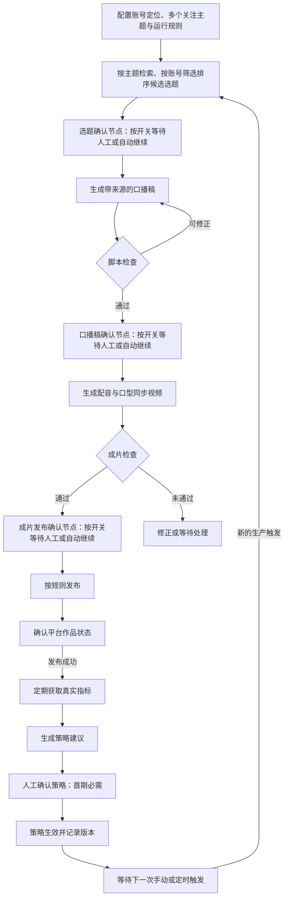

# 视频生成与运营闭环平台 PRD

版本：v0.35（核心需求基线，按技术可行假设推进）  
日期：2026-09-21  
来源：[视频生成专题](视频生成专题.md)及需求澄清记录

配套设计：[技术方案](技术方案.md)、[开发实施计划](开发实施计划.md)、[业务术语](CONTEXT.md)。技术方案中的工程初值用于实施，不改变本文已确认的产品规则。

## 1. 产品定位与已确认决策

构建一套以虚拟数字人口播为载体的视频生产与运营系统，完成“热点检索 → 选题 → 口播稿 → 数字人视频 → 审核 → 自动发布 → 数据回收 → 策略优化 → 下一轮生产”的完整闭环。

首期目标是**用一个场景打通真实闭环，验证可行性**。不以高画质、精细音色、优秀文案或爆款效果作为首期目标。

| 事项 | 状态 | 首期口径 |
| --- | --- | --- |
| 产品范围 | 用户已确认 | 包含热点检索、自动发布、监控和策略优化的完整闭环 |
| 实施深度 | 用户已确认 | 优先打通单条链路，不严格要求成片质量 |
| 视频类型 | 用户已确认 | 虚拟数字人口播，要求口型同步 |
| 形象来源 | 用户已确认 | 用户会上传形象；首期同时必须支持文生图生成形象，两种入口均可用于后续数字人口播 |
| 目标平台 | 用户已确认 | 首期仅接入抖音；测试账号、接入方式、发布权限及数据读取能力待核验 |
| 抖音账号准备情况 | 用户已说明 | 目前没有用于测试的抖音账号，也没有抖音开放平台开发者账号或应用；账号准备及能力验证属于接入前置工作 |
| 模型/API 接入方向 | 用户已确认 | 文本与图像等云端生成接入百炼 API，用户已有可用 API；TTS 按最新要求改为本地 CosyVoice 3，具体版本与能力需验证 |
| TTS 与音色克隆 | 用户已确认 | 首期本地部署 CosyVoice 3；用户提供本人或已获授权的参考录音及对应文字，试听确认后作为账号固定音色；实际素材尚待提供，部署与效果需实测 |
| 模型能力覆盖 | 待核验 | 分别验证百炼文本/文生图、本地 CosyVoice 3 配音和音频驱动口型同步；TTS 本身不生成数字人口型视频 |
| 技术推进前提 | 用户判断可行，作为设计假设 | 按抖音发布与数据读取、本地 CosyVoice 3、克隆配音驱动数字人口型均可行推进方案；具体权限、版本和接口适配在实施阶段核验，不作为需求基线确定的阻塞项 |
| 单条视频时长 | 用户已确认 | 默认目标为 30～60 秒，保留配置能力；以最终成片实际时长核验 |
| 默认画面规格 | 用户已确认 | 9:16 竖屏、720×1280 像素，以最终成片核验；生成服务与抖音接入的兼容性待验证 |
| 首期成片形式 | 用户已确认 | 单个数字人＋固定背景＋同步字幕；不自动插入新闻图片、素材视频或复杂转场 |
| 部署方式 | 用户已确认 | 首期运行在用户当前 Windows 电脑，通过浏览器操作；云端模型调用百炼，TTS 本地部署 CosyVoice 3；关机或休眠期间本地调度及 TTS 无法执行 |
| 首期 API 联调预算 | 用户已确认 | 总预算 200 元，其中首轮能力验证不超过 50 元；累计达到 160 元提醒，达到 200 元暂停新的付费调用；异步调用需预留费用 |
| 目标用户、内容赛道 | 用户已确认，暂定设计基线 | 个人内容创作者，中文知识或资讯口播 |
| 首个测试账号定位 | 用户已确认 | 面向普通职场人的 AI 工具与效率资讯，初始关注 AI 办公、会议记录、文档处理三个主题，作为首期联调与验收场景 |
| 账号与主题范围 | 用户已确认 | 首期实际运行一个账号，账号可配置多个关注主题；按账号定位检索和筛选，后续扩展多账号运营 |
| 首期检索来源范围 | 用户已确认 | 允许公开新闻、行业网站等来源，不限于抖音；首期不强制接入抖音热榜，有可核验热度依据才标为热点，无热度依据标为近期资讯 |
| 资讯补位规则 | 用户已确认 | 无合格热点时允许同一账号主题范围内的近期资讯补位，默认近 7 天，可配置；不自动扩大主题或时间范围，无合格内容则跳过 |
| 发布前时效复查 | 用户已确认 | 提交发布请求前再次核验事件是否仍在配置时间窗口内；过期转待处理，重新选题或由用户调整范围后复查，不凭旧检查结果放行 |
| 首期素材配置 | 建议默认 | 单用户操作，每个账号选定一个当前形象与音色供任务复用 |
| 自动化边界 | 用户已确认 | 默认配置规则后自动发布；策略先给建议，确认后生效；第一版保留人工/自动化切换 |
| 切换方式 | 用户已确认 | 选题、口播稿、成片发布三个节点分别设置人工确认开关；开启后暂停等待查看或修改，确认后继续，关闭则自动执行 |
| 策略生效方式 | 用户已确认 | 首期必须人工确认后生效，不提供策略自动生效开关；生效版本供下一条新任务使用 |
| 首期优化对象 | 用户已确认 | 根据本账号各主题视频表现，建议提高或降低已有关注主题的推荐优先级，确认后用于后续选题；不自动新增主题或修改排除范围 |
| 主题优先级规则 | 用户已确认 | 高、中、低三档，初始均为中；每次建议对受影响主题升降一档，经人工确认后生效，参与合格候选排序 |
| 候选排序顺序 | 用户已确认 | 先筛选合格内容；有合格热点时仅在热点中排序，否则以近期资讯补位；候选按主主题高→中→低排序，同档内结合热度与时效性选择 |
| 主题表现评估口径 | 用户已确认 | 主要比较各主题视频发布后 24 小时播放量的中位数，互动指标作为辅助，不混成总分；不足 24 小时的数据仅用于明确标注的探索性建议，字段以抖音实际可读取能力为准 |
| 主题表现回看范围 | 用户已确认 | 默认纳入最近 30 天发布的视频，保留配置能力；每条视频仍采用发布后 24 小时观察值，样本不足沿用探索性建议规则 |
| 策略评估频率 | 用户已确认 | 有新增有效指标时，每个账号每天最多自动评估一次，支持手动评估；无新数据不重复生成相同建议，已有待确认建议时不反复堆积 |
| 视频主题归属 | 用户已确认 | 每条视频确定一个主主题，其他主题作为辅助标签；表现数据只计入主主题；主主题随选题确认，自动模式由系统判断并说明理由 |
| 冷启动与低样本策略 | 用户已确认 | 无真实数据时保持初始优先级；有真实数据但样本较少时允许探索性建议，人工确认后试用；首期验证闭环，效果评估后续优化 |
| 生产触发方式 | 用户已确认 | 每次手动或定时触发只生产一条；策略确认后更新优先级，等待下一次触发采用，不立即启动下一轮生产 |
| 定时生产默认规则 | 用户已确认 | 首期默认关闭，先手动跑通；开启后默认每天生产 1 条，执行时间可配置，受预算限制 |
| 错过定时生产 | 用户已确认 | 关机、休眠或服务停止导致错过触发时，恢复后不自动补做；记录错过情况，等待下一个计划时间，需要补做时手动触发 |
| 发布时机 | 用户已确认 | 支持检查及必要确认通过后立即发布，或按指定时间发布；错过指定时间转待处理，由用户选择立即发布或重新排期，不自动补发 |

文中的“建议默认”与“本稿设计建议”用于推进设计，不代表用户已确认。用户已同意暂按上述用户与内容方向设计，后续可根据实际试用调整。平台接口可用性、供应商口型同步能力、费用与平台规则均需实际验证。

用户认为抖音发布与数据权限、本地 CosyVoice 3、克隆配音驱动数字人口型这三项技术上可行。本稿据此继续产品与技术设计，不反复要求用户确认可行性；实施时将账号授权、具体模型和音视频接口适配作为接入任务。此处是推进假设，不是已完成调用或验收的记录，真实闭环验收标准保持不变。

## 2. 用户问题与目标

### 2.1 典型使用场景

运营者为账号配置定位、目标受众、多个关注主题、不关注的主题、内容风格、虚拟形象、音色、时长范围、发布计划和自动化规则。系统按账号关注主题检索内容，先判断账号相关性，再结合主题推荐优先级、热度、时效性与本账号选题历史排序，从候选中选择一个选题生成口播稿和视频。发布后收集该账号各主题视频的表现，提出提高或降低主题推荐优先级的建议；人工确认后，该账号下一次新任务使用新策略。

例如同一“AI 手机发布”事件，对科技资讯账号可推荐功能介绍，对职场效率账号可推荐办公应用角度，对历史科普账号则不推荐。首期只运行一个账号，后续多账号可复用公共事件资料，但分别生成适合账号的内容角度，维护各自的运营记录和策略。

用户已同意暂按“个人创作者，中文知识或资讯口播”设计。首个测试账号定位已确定为“面向普通职场人的 AI 工具与效率资讯”，初始关注 AI 办公、会议记录、文档处理三个主题，优先解释工具或新功能对日常工作的实际价值。账号配置仍可修改，不把这一领域写死为平台唯一支持方向。

首期联调使用以下主题配置；候选方向为示例，不代表已发现真实事件：

| 初始主题 | 面向受众的信息价值 | 示例选题方向 |
| --- | --- | --- |
| AI 办公 | 了解可用于日常工作的新工具或功能 | 某办公工具新增 AI 辅助功能及适用工作场景 |
| 会议记录 | 理解记录、摘要和行动项整理能力 | 某会议工具发布转写或纪要相关更新 |
| 文档处理 | 了解文档阅读、提炼和整理效率变化 | 某文档工具新增摘要、信息提取或格式处理能力 |

三个主题均默认启用且初始优先级为中。AI 办公与其他主题存在交集时，仍按拟采用的口播角度确定唯一主主题，其余作为辅助标签。真实验收从检索结果中选取符合已确认主题、时效和来源要求的事件，不以虚构示例替代；无合格内容时按规则跳过。首期不以组织协作、商业订单或多客户交付为前提。

### 2.2 产品目标

1. 完成至少一条视频从真实检索到真实发布、真实数据回收的链路。
2. 根据回收数据形成可解释的策略建议，并应用于下一轮任务。
3. 每一步可查看输入、输出、状态、耗时和失败原因，失败后可恢复。
4. 保留可播放、有人声、基本口型同步和必要的发布约束；其他质量问题先以提示为主。

### 2.3 首期不纳入

- 多平台、多账号同时运营、跨账号调度和批量并发运营；首期保留账号归属和配置边界，不交付完整矩阵运营功能。
- 真人形象复刻、复杂数字人训练和专门的音色模型训练；基于参考音频的声音克隆按最新要求纳入首期。
- 复杂分镜、多人对话、电影级镜头与专业剪辑工作台。
- 根据选题自动插入新闻图片、素材视频、动态背景或复杂转场；检索资料用于选题和事实依据，不默认作为成片视觉素材。
- 多租户、审批层级、付费计费和团队权限体系。
- 自动回复评论、私信、直播、投流与交易转化追踪。
- 以大量历史数据训练推荐模型、严谨因果归因或自动无限制实验。
- 策略自动生效；首期所有策略调整均需人工确认。
- 根据效果数据优化标题风格、发布时间或关键词集合；首期策略优化只调整已有关注主题的推荐优先级，原有标题生成和发布排期功能保留。

## 3. 首期闭环与范围控制

所有自动修正均有次数上限，超过上限进入待处理状态，避免循环生成。默认自动发布、人工确认策略；人工/自动化切换规则见 FR-11。

| 环节 | 首期必须支持 | 后续增强 |
| --- | --- | --- |
| 检索选题 | 一个可用检索接入渠道，覆盖公开新闻、行业网站等内容；账号多主题、相关性、热度依据、时效性及去重 | 抖音热榜专项接入、多渠道交叉排序、跨账号分发与复杂趋势发现 |
| 数字人 | 上传形象与文生图两种入口、选定一个形象复用、一种音色、口型同步 | 多角色、多风格、精细动作 |
| 文案 | 一版可用口播稿，长度和基本事实检查 | 多版本创意竞争、复杂风格控制 |
| 视频 | 单个数字人、固定背景、本地配音、口型同步、基础同步字幕与可发布文件 | 新闻配图、素材视频、转场包装、复杂剪辑及高清优化 |
| 发布 | 抖音、一个账号、定时或立即自动发布 | 其他平台适配、多账号调度 |
| 数据 | 回收平台可提供的核心指标，展示刷新状态 | 跨平台归因、详细人群分析 |
| 优化 | 基于本账号主题表现建议调整推荐优先级，人工确认后用于下一轮选题 | 标题风格与发布时间优化、自动实验及持续自适应优化 |
| 运维 | 基础部署、任务追踪、有限重试和成本记录 | 高可用、弹性扩容 |

“单条链路”指先实现一种标准数字人口播生产方式。首期必须支持上传形象与文生图两个入口，两者汇入同一口播生成流程；图生图、独立通用图生视频和多个数字人方案不作为首期必需能力。

## 4. 角色、对象与页面

### 4.1 角色与核心对象

首期只有运营者角色，负责配置、查看结果、处理异常和按规则确认策略。

| 对象 | 定义及关键内容 |
| --- | --- |
| 运营账号 | 系统内稳定账号标识、名称、定位、目标受众、内容风格、不关注的主题；首期绑定一个平台账号 |
| 关注主题 | 归属运营账号，包含主题名称、检索关键词及启用状态；每个账号可配置多个，推荐优先级由账号策略版本记录 |
| 运营配置 | 归属运营账号，包含形象选择、音色、平台账号绑定、时长、频率、预算和人工确认开关 |
| 公共事件资料 | 标题、摘要、来源链接、来源发布时间、检索时间、热度依据；可供后续多个账号复用 |
| 账号选题 | 归属运营账号，关联事件资料、匹配主题、唯一主主题、辅助标签、主主题判断理由、相关性、推荐原因、内容角度和采用状态 |
| 生产任务 | 一次从选题到成片的执行，关联运营账号、选题、配置快照、策略版本、各阶段产物 |
| 脚本版本 | 正文、事实来源、预计时长、审核结论、修改原因 |
| 素材 | 形象图片、音频、视频、字幕、授权或生成来源、供应商任务标识；账号的形象选择及任务对素材版本的引用明确记录 |
| 发布记录 | 平台、账号、绑定成片版本、计划时间、作品 ID、链接、发布状态 |
| 指标快照 | 运营账号、发布记录、作品 ID、指标值、采集时间、平台口径与缺失原因 |
| 策略版本 | 归属运营账号，包含主题推荐优先级（高、中、低）、调整前后值、主题表现依据、适用范围、生效状态、上一版本和回滚记录 |

运营账号是系统内的内容运营主体，平台账号是外部发布身份。首期两者一对一绑定；公共资料可复用，选题采用状态、内容角度、任务、发布数据和策略均按运营账号记录。首期不要求跨账号切换页面或共享素材权限体系。

### 4.2 最小页面集合

1. **配置页**：当前账号定位、受众、内容风格、不关注的主题、多个关注主题及关键词、数字人、模型服务、发布账号、时长、计划、预算，以及三个独立人工确认开关；显示连接是否可用。数字人配置提供形象上传、文字描述生成、图片预览及选择使用入口。
2. **任务列表与详情页**：所属账号、主主题、辅助标签、匹配主题及主主题判断理由、阶段状态、候选选题及推荐原因、热度依据、脚本及来源、音视频预览、检查结果、耗时、费用、失败原因；支持选题替换、主主题调整、脚本修改、确认继续、重试、暂停后续步骤和取消。
3. **运营概览页**：当前账号的发布作品、真实指标、采集状态、异常提醒，以及按主题展示的表现与推荐优先级调整建议；展示调整前后值、依据和样本量，支持确认策略、查看生效版本和回滚。

无需为每个 Agent 单独设计页面。技术执行细节可放在任务详情的诊断区域。

## 5. 功能需求

### FR-01 运营配置与任务触发

- 支持手动触发与定时触发；每次触发只创建一条生产任务，选择一个选题，目标产出一条视频。无合格选题时允许跳过，不保证每次触发都产出成片。
- 定时生产默认关闭，先通过手动任务验证链路。运营者显式开启并配置每日执行时间后，默认每天触发一次，目标生产一条；页面显示开关、执行时间、时区和下一次计划触发时间。此处为生产时间，独立于发布计划。
- 每次定时执行仍检查账号配置、全局暂停状态及预算，额度不足不提交新付费调用。每天 1 条是默认定时生产目标，不是成功产出承诺，也不限制用户另外手动发起任务；手动任务同样受预算与串行执行限制。
- 关闭定时生产后停止未来的定时触发，已有任务继续按各自状态处理；如需停止已有任务的后续步骤，应使用暂停或取消操作。开启定时生产不改变三个人工确认开关。
- 本机停机或休眠期间错过的定时生产不自动补跑。恢复后根据持久化计划记录错过的计划时间、发现时间及可确定原因，无法确认具体关机或休眠原因时如实显示“本地调度未运行”；计算并展示下一个未来执行时间，不将错过的触发批量转换为生产任务。
- 需要补做时由运营者手动触发一条新任务，使用当前配置与已生效策略，仍受人工确认、预算和串行执行约束。停机前已经创建的任务按原有恢复规则处理，不属于错过的触发；恢复前先核对任务与外部调用状态，避免重复执行。
- 策略建议生成、人工确认策略、发布完成和指标刷新均不直接触发新视频生产。策略确认后等待下一次手动或定时触发，新任务使用届时已生效的策略版本。
- 同一任务内的有限重试、脚本改写和视频重生成属于恢复或修正，不创建下一轮生产任务；产生的历史版本保留，不能因此自动增加发布条数。
- 当前账号可新增、编辑和停用多个关注主题，至少启用一个；账号定位包括受众、内容风格和排除方向。多主题扩大候选覆盖范围，不表示一次触发自动为每个主题各生成一条视频。
- 任务创建时绑定运营账号及配置快照，使用该账号选定的形象、发布身份和已生效策略；后续修改账号配置不覆盖历史任务记录。
- 必填项为内容方向、可用生成服务、虚拟形象或生成方式、音色、目标账号、视频时长范围与发布规则。
- 视频时长默认最短 30 秒、最长 60 秒，支持按账号配置并保存到任务快照；配置需满足最短时长大于 0、最长时长不小于最短时长，以及选定生成服务和抖音接入方式的实际限制。
- 时区明确显示，演示环境建议使用 Asia/Shanghai；保存和展示的时间口径保持一致。
- 支持手动输入主题，用于调试或指定内容；最终闭环验收必须覆盖真实热点检索路径。
- 运行前检查配置、接口连接、账号有效性、配额和必要素材，缺失时显示可操作原因。
- 提供“暂停自动化”开关，停止创建新任务和执行尚未发出的发布请求；已提交外部平台的请求继续核对结果。

### FR-02 热点检索与选题

- 首期允许从公开新闻、行业网站等来源发现账号相关内容，不将抖音热榜作为必需接入项。发布平台与选题来源分开配置和验证，未完成抖音账号接入时仍可检索公开资料。
- 首期先打通一个可用检索接入渠道，该渠道可返回多个网站的资料；不要求为每个网站单独开发采集器。具体检索工具、可访问站点、热度信号及费用在选型时核验，百炼 API 可用不等于检索能力已验证。
- 保存原始文章或公告的链接与出处，搜索摘要可用于发现候选，关键事实需回到可访问来源核对。新闻或行业网站来源身份本身不证明热度；无榜单、热度值等可核验信号时走已确认的近期资讯补位流程，不能宣称代表抖音站内热度。
- 根据当前账号启用的各关注主题、关键词与可配置时间窗口检索候选内容，保留标题、摘要、来源 URL、来源时间、检索时间及匹配主题。
- 合并多个主题命中的同一事件并保留主题关联；先检查账号相关性、排除方向、时间范围、事实依据及账号内重复情况，再按下述已确认顺序排序，选择一个选题进入生产，其余保留备查。首期不保证每个主题都有候选或平均获得发布机会。
- 每个候选选题根据拟采用的口播角度，从当前账号匹配的已启用主题中确定一个主主题，其他匹配主题作为辅助标签。主主题随选题一起展示和确认；关闭选题人工确认时由系统确定并保存理由，无法明确判断时转人工处理。
- 主主题决定该视频后续的主题统计归属，不能仅为获得更高推荐优先级而选择与内容角度不符的主题。选题排序使用主主题的优先级，不累加辅助主题的优先级。
- 发布前修改主主题需保留选题版本和修改原因，按选题确认开关重新确认，并复查脚本与内容角度是否相符；若内容发生变化，按原有规则使受影响的下游产物和确认失效。
- 热度与账号相关性分别展示。热度依据可为来源提供的榜单位置、热度值或互动数据等，需记录来源、指标口径和采集时间；来源未提供热度信号时标为“近期资讯／热度未知”，不能仅凭搜索排名或模型判断宣称是热点，不直接混加不同来源的热度数值。
- 候选展示为何适合当前账号、匹配了哪些主题及建议口播角度；无关事件即使热度高也不自动采用。
- 优先选择账号范围内、有热度依据且符合选题条件的热点；无合格热点时，允许相关近期资讯补位，明确标记“近期资讯”及补位原因。补位沿用同一账号主题、受众、排除方向和时间范围，只放宽热度要求，不绕过检查或人工确认开关。
- 有合格热点时只在合格热点中排序；没有合格热点时，进入合格近期资讯候选排序。两种情况下均先按主主题优先级高→中→低排列，同档内再结合热度与时效性选择。因此高优先级主题的合格热点排在低优先级主题的更热门事件之前，但高优先级资讯不能越过低优先级的合格热点。
- 高优先级主题无合格候选时，选择其他已启用主题的合格候选；优先级不跳过相关性、时效性、去重和其他检查。低档仍可入选，不等于停用主题；同档热度与时效性的具体排序方式根据检索来源可提供的数据在技术方案中确定并记录，不能跨档改变已确认顺序。
- 排序使用候选主主题在任务绑定策略版本中的档位，初始主题均为中档。推荐理由显示内容类型（热点或资讯）、主主题档位、热度依据、事件时间及最终采用原因，不用未展示的连续权重替代已确认档位。人工模式可在合格候选中选择其他选题，系统保留推荐结果与最终人工选择的区别。
- 首期时间窗口默认近 7 天，允许运营者配置；强时效主题可手动缩短至 24～72 小时。以检索时刻向前计算，保留所用窗口；采用事件或实质性进展的发布时间及依据，不能用转载时间或网页更新时间将旧事件当作新资讯。时间无法核实时转人工处理。
- 候选至少匹配一个已启用关注主题，并能说明对目标受众的信息价值；明确命中排除方向的内容不自动采用。关键词用于检索，模型可辅助判断相关性，但需给出理由，不能只凭关键词命中或单一分数放行。
- 相关性不明确、来源不可访问或关键事实缺乏依据时转人工处理，不直接进入自动生产。候选展示匹配主题、受众价值、事件时间、来源及补位原因。
- 无合格热点且无合格近期资讯时跳过本次生产并记录原因；系统不自行新增主题、扩大时间窗口或循环补产。需扩大范围时，由运营者修改配置后重新触发。
- 开启选题人工确认后，展示推荐选题和候选资料并等待；运营者可确认、替换候选或修改主题。修改主题后重新检索与检查资料，确认当前选题版本后才生成脚本。
- 标记无法确认发布时间或关键事实的结果；无合适选题时跳过本次生产并说明原因。
- 对来源 URL、标题和当前账号近期已采用、正在生产及已发布选题做基础去重；避免同一账号为同一事件重复排队或连续发布。同一事件出现有来源支持的实质性进展时可重新评估，需记录相对旧选题的新增事实，仅换标题或转载不算新进展。后续扩展时，不因其他账号采用过该公共事件就一律排除，应结合当前账号角度判断。
- 外部网页内容仅作为资料，不能更改系统的发布、凭据、费用或自动化规则。

### FR-03 口播稿生成与检查

- 输入为选题、资料、目标受众、风格、时长范围及当前策略，输出为正文、事实依据和预计朗读时长。
- 支持开场、主体、结尾的基础结构；检查主题相关性、明显重复、长度和不当内容。
- 可核查事实关联来源；证据不足时删除、改写为不确定表述或进入待处理，不补造事实。
- 未通过时给出具体原因，在有限次数内自动改写；也支持运营者手动编辑后重新检查。
- 开启口播稿人工确认后，检查通过的脚本进入待确认；运营者可编辑或要求重新生成。修改后的版本重新检查并确认通过后，才开始配音与视频生成。
- 预计时长用于初筛，最终以实际音频和成片时长为准。
- 默认按 30～60 秒目标生成脚本，结合所选音色的语速估计长度；实际配音超出任务时长范围时，按有限修正规则调整脚本并重新检查，开启脚本人工确认的任务需重新确认。不能仅凭字数判断成片时长合格。
- 首期不要求文案优美或保证原创度评分；明显重复与无依据事实仍需处理。

### FR-04 虚拟数字人、配音与口型同步

- 首期必须同时支持上传已有虚拟形象图片和通过文字描述生成形象，不能仅实现其中一种。
- 首期按百炼平台 API 方向验证文生图和数字人口播能力，配音改为本地 CosyVoice 3。数字人环节必须验证可接收本地产生的音频驱动口型，不能默认仅接收文本、重新配音的一体化服务能保留所选克隆音色。若存在能力缺口，记录并单独澄清补充方案。
- 上传入口接收用户提供的图片，检查图片可解码及所选数字人服务要求的格式、尺寸、人脸数量和可用姿态；不符合时提示更换或调整，不能直接标记可用于口播。具体限制在供应商选型后确定。
- 文生图入口接收形象描述，调用一个实际可用的文生图服务生成图片，展示生成状态、结果预览与失败原因；支持修改描述后重新生成，每次调用记录费用与结果。
- 两种入口汇入统一形象选择流程。本稿建议由用户预览并选择当前使用形象，作为运营配置准备步骤；生成新图片不自动替换当前形象，不在每次视频任务中自动重新生成形象。
- 保存形象来源、图片文件、版本，以及文生图的描述、模型和供应商任务标识（如有）；文生图结果同样需通过数字人输入检查。
- 选定形象可供后续任务复用，每条任务绑定具体形象版本。切换当前形象默认只影响新任务；对已有任务显式更换形象时，重新生成受影响的视频并重新检查、确认，保留仍有效的脚本和音频。
- 本地 CosyVoice 3 接收最终口播稿与音色资料生成配音。首期采用 zero-shot 路径，提供参考音频、对应文本和来源记录的配置入口，支持生成短句试听并选定音色复用，不增加音色训练流程。已核验官方候选模型 `FunAudioLLM/Fun-CosyVoice3-0.5B-2512`；当前代码参考音频不超过 30 秒，输出采样率为 24 kHz。参考录音时长限制不等于输出时长限制，30～60 秒配音仍需实际验证。
- 用户提供一段本人或已获授权的参考录音及对应文字，保存来源说明；配置流程为上传录音、填写或校对对应文字、生成短句试听、用户确认并设为账号固定音色。首期由用户提供转写文本，不要求额外实现自动语音识别。
- 音色试听确认属于账号准备步骤，不受选题、口播稿、成片发布三个确认开关控制；未经试听确认的音色不能供正式生产任务使用。后续任务复用已确认音色，无需每条重复试听，也不按主题自动切换音色。
- 修改参考录音或对应文字后形成新的音色资料版本，需重新试听确认；确认新版本前保留原已确认音色，新生成的试听不能自动覆盖当前账号音色。尚未配置已确认音色时，任务显示待配置原因，不替换成其他声音继续生成。
- 音色资料关联账号并保存版本；任务绑定音色版本、脚本版本、模型版本与实际输出音频。更换音色默认影响新任务，对已有任务显式更换时重新生成配音、口型视频和字幕时间轴，重新检查受影响产物。
- TTS 服务执行健康检查，保存生成耗时、音频时长、采样率及错误原因。参考素材不合格、模型未就绪或显存不足时给出可恢复状态，不静默切换到云端音色或另行付费调用。
- 根据形象与口播音频生成数字人视频，要求嘴部动作与语音节奏基本对应。
- 数字人生成使用选定的本地配音文件，按服务要求重采样或转换封装，但不替换说话内容及音色；转换后以实际音频对齐字幕和口型。若数字人服务需下载音频，明确本地文件上传及临时访问方式。
- 原文中的通用“图生视频”不能直接视为口型同步方案；选型必须验证音频驱动或等效的口型同步能力。
- 图生图作为可选的形象调整能力，首期无需独立实现。
- 外部生成任务保存任务 ID，支持状态查询和超时处理，避免重复付费提交。

### FR-05 成片制作与检查

- 首期画面保持单个数字人、固定背景与同步字幕，不根据口播内容自动切换场景或插入新闻图片和素材视频。允许口型与基础自然动作，固定背景不等于人物静止。
- 固定背景优先沿用用户选定形象素材中的背景，或使用简单固定画布；这是实现建议，不要求首期增加抠像、背景生成或独立背景编辑器。画面按既定竖屏规格适配，保持人物与嘴部完整。
- 输出口播视频及基础字幕；首期建议烧录字幕，字幕时间轴与最终音频匹配。
- 字幕采用统一基础样式，保持可读且不遮挡主要口型区域；同步依据最终配音时间轴，不能按总时长均分文字冒充同步。具体对齐方式与生成服务输出在技术方案中验证，首期不增加逐字动效和复杂字幕编辑。
- 字幕来自最终使用的口播稿，成片与脚本、音频、形象版本一一关联。
- 首期最终成片默认输出 9:16 竖屏、宽 720 像素 × 高 1280 像素；在任务快照中记录输出规格，以成片实际显示方向和宽高核验，不能仅凭生成请求参数判定合格。
- 生成服务返回其他尺寸时，可通过基础合成适配到目标画布，保持人物比例，不拉伸面部或裁掉嘴部；字幕在最终画布上排版。源素材质量不足时提示，输出尺寸不等于原生清晰度保证。
- 封装格式、编码、文件大小及标题/封面要求按抖音实际接入方式核验；需要封面时可先采用视频抽帧。若默认画面规格与实际能力存在冲突，说明缺口并确认调整方案，不静默改变已约定规格。
- 自动检查文件可解码、存在音视频流、时长有效、满足目标平台的硬性文件约束。
- 最终成片实际时长须落在任务配置范围内（默认 30～60 秒）；超出时提示实际值与目标范围，进入修正或待处理，不直接标记时长检查通过。首期不靠截断末尾口播来强行满足时长。
- 明显无声、黑屏、生成失败等问题阻止自动发布；画质一般、音色普通和文案不够精细可提示后继续。
- 口型同步首先通过供应商能力验证与人工抽查验收，首期不要求自建高精度自动口型评分模型。
- 运行中发现明显口型错误时允许标记并重新生成；修改脚本后，旧配音、旧成片及其审核结论失效。

### FR-06 内容与素材检查

- 脚本和成片分别保存“通过、需修改、待人工处理”的检查结论及原因。
- 首期只做明确、可执行的基础规则，不能将自动检查结果表述为法律合规保证。
- 保存形象、声音及其他素材的生成或授权来源；缺少必要来源记录时提示补充并暂停相关发布。
- 按抖音要求提交合成内容标识；具体规则及所选接入方式是否支持，在接入验证时确认。
- 对明显违规或关键事实无法核实的内容阻止自动发布；模型判断不确定时进入待处理。
- 高风险内容领域不作为默认演示主题，若后续选择此类场景，补充对应规则后再接入。

### FR-07 自动发布

- 首期目标为抖音，只绑定和运行一个抖音账号。发布接入方式尚未确定，需先核验实际账号及应用是否具备所需权限；不能因为账号可以手动发视频就认为已具备程序发布能力。
- 当前尚无测试账号及开放平台开发者账号或应用。账号未准备时显示“未配置／待接入验证”，真实发布入口不可执行；不得显示已连接或发布成功。账号登录、实名及授权等需要账号持有人参与的步骤由用户完成，具体要求以实际接入核验为准。
- 绑定一个有效平台账号，支持“立即发布”和“指定时间发布”两种方式。立即发布是在成片检查及所有已开启的人工确认通过后提交；指定时间发布是在前置条件满足后等待指定时间提交，不能提前发送发布请求。
- 生产触发时间与发布计划时间分别保存和展示；配置指定发布时间不表示到该时刻才开始生产。记录计划提交时间、实际提交时间和平台确认的发布时间；指定时间以系统提交请求为目标，平台处理或审核完成时间不保证精确一致。
- 支持人工模式：检查通过后进入待确认，运营者预览并确认提交或排期；系统仍负责调用平台接口，人工模式不等于手动下载上传。
- 自动准备标题、标签及平台需要的其他字段，发布前校验规格与字段限制。
- 每次实际提交发布请求前，按提交时刻重新核验事件或实质性进展的发布时间是否仍在适用时间窗口内（默认近 7 天）；热点与补位资讯均适用。立即发布、指定时间发布、错过时间后人工补发和重排时间后发布都执行复查，不能以先前审核或人工确认代替。
- 超出窗口时标记“待处理／内容已过期”，显示事件时间、检查时间和适用窗口，停止发布。用户可重新选题，或显式调整该账号时间范围并将新规则应用于此待发布任务，再重新检查；系统不自动扩大范围，也不只凭再次点击确认绕过时效检查。
- 已创建任务沿用其记录的时间规则，普通账号配置变更不静默覆盖历史快照；用户明确对待处理任务应用新范围时，保存旧规则、新规则、操作者及新的检查结果。若重新选题或改写内容，按既有规则重新生成受影响产物并执行必要确认。
- 复查结果绑定内容版本、时间规则版本和检查时刻；检查后继续等待的任务在实际提交前仍需重新核验。事件时间无法确认时转人工处理，不用转载时间刷新有效期。已经提交平台的请求继续核对结果，不因平台审核期间跨过窗口而重复提交或自动删除作品。
- 发布绑定已检查的成片版本；发布队列中的内容被修改后，需要重新检查并更新绑定。
- 严格区分“请求已提交、平台处理中、已发布、被拒绝、结果未知”，取得平台可核验状态后才标记成功。
- 保存作品 ID、链接、发布时间与响应摘要；令牌失效、限流、审核拒绝等情况给出可处理原因。
- 提交超时或结果未知时优先查询或人工核对，不直接重发，防止重复作品。
- 通过发布记录唯一性与幂等标识防止同一成片重复发布；故意再次发布需显式新建发布记录。
- 错过指定时间仍未提交发布请求时，转为“待处理／错过发布时间”，记录生成未完成、确认未完成、调度中断等原因，不自动补发；运营者可选择立即发布或重新排期。
- 对错过时间的任务选择立即发布或重新排期，不代表跳过成片检查和必要确认；前置条件未满足时明确展示待完成项。错过时间后即使生成或人工确认随后完成，也不能自动恢复旧排期。
- 对已经提交的平台请求继续查询结果；平台处理中或审核耗时导致晚于计划公开，不作为未提交的错过时间任务重新发送。
- 重新排期记录原计划、新计划、操作者及原因，重新检查当前成片与发布信息版本；重复点击或重复调度不得产生重复发布请求。调度精度与执行容差在技术方案中明确，不能将长期中断后的补跑当作正常到点执行。

### FR-08 指标回收与监控

- 根据发布记录定时拉取数据，保存各时间点快照，并展示最后成功采集时间。
- 发布记录保存任务采用的主主题快照。主题表现统计中，每条作品的播放、互动和样本数只归入该主主题一次，辅助标签用于检索和展示，不重复贡献主题样本或指标；同一作品多次采集的累计快照也不能相加为多条作品数据。
- 主主题名称变更或停用后保留历史归属，不将已有作品迁移到其他主题。本稿首期按发布时主主题快照统计；如需纠正已发布作品归属，应另行设计有记录的更正流程，不静默改写历史策略依据。
- 关注播放/曝光、点赞、收藏、评论和转发；以平台实际开放字段为准。
- 至少需要一个核心触达指标和一个互动指标形成真实数据反馈；需验证抖音测试账号及接入方式实际可读取的字段，无法满足时说明缺口并与用户确认处理方案，不能自行更换已选平台或伪造指标。
- 对不支持、尚未产生、获取失败的指标显示具体状态，不能统一填成 0；真实返回 0 则记录为 0。
- 首期只采集评论数量，不要求采集评论正文。
- 主题表现主要观察窗口为发布后 24 小时，从平台可核验的实际发布时间起算，不从计划时间或请求提交时间起算。采集周期受抖音实际接入配额约束，首期建议按小时采集，具体频率和 24 小时采样容差待权限与数据延迟核验后确定。
- 优先使用平台提供的发布后 24 小时统计；若仅提供当前累计值，则保存接近 24 小时的实际采集快照，并标明实际观察时长和采样偏差。超出约定采样容差或未采到有效快照的作品，标为“24 小时数据缺失”，不能用数日后的最新累计值冒充。
- 展示作品列表、核心数值、趋势、发布和采集失败提醒；首期使用站内提示，无需外部消息推送。
- “爆款提醒”首期按可配置播放阈值或同观察窗口的历史基线触发；无基线时仅展示数据，不宣称爆款判断有效。

### FR-09 策略优化与反馈

- 有新增有效指标时，每个账号按配置时区的自然日每天最多自动评估一次；支持运营者手动评估。评估可得出“保持当前优先级”或“证据不足”，不要求每次生成调整建议，也不会触发新视频生产。
- 新增有效指标包括新取得的作品观测、进入可用 24 小时窗口的快照或指标值的有效更新；仅采集时间变化而指标值和可用性均未变化，不作为新数据。首次取得真实零值属于有效观测，采集失败或缺失占位不属于有效指标。
- 持久化账号上次评估时间、数据依据、配置及策略版本和当日自动评估记录，防止重启或重复采集造成同日重复自动评估。自动评估涉及付费调用时仍需通过预算检查。
- 每个账号首期保留至多一份当前待确认建议，已有建议时不继续堆积。数据采集照常进行，可提示有新数据；运营者可先处理现有建议，或手动重新评估，以新结论明确替代旧建议并保留历史。重新评估不自动确认任何建议。
- 手动评估可在当日已自动评估后执行，但仍去重：数据依据、配置及策略版本均未变化时复用已有结果，不重复付费生成相同建议。已确认、已拒绝或被替代的建议保留记录，不因重复读取同一批数据重新进入待确认。
- 基于当前账号按作品主主题归集的真实指标、选题及当时使用的策略生成建议，显示依据、样本量和不足；辅助标签不重复参与主题表现归集，策略确认、生效和回滚均针对该账号，后续多账号不自动混用其他账号的结论。
- 首期只优化已有关注主题的推荐优先级：根据本账号各主题视频表现建议提高或降低优先级，确认后参与后续选题排序。不自动新增主题、改变关键词、停用主题、修改排除范围，也不调整标题风格或发布时间。
- 策略建议至少包括账号、受影响主题、优先级调整前后值、采用的指标与观察窗口、样本量、触发依据、预期影响和适用的后续任务；“提高优先级”表示增加推荐倾向，不等于保证该主题获得固定发片数量。
- 首期优先级为高、中、低三档，初始各主题均为中，新建主题也默认中档。每次建议对受影响主题只升或降一档，允许低→中、中→高、高→中、中→低，不允许低→高或高→低跨档调整；高档不再上调，低档不再下调，无合理变化时可不提出调整。
- 建议展示具体档位变化及依据，经人工确认形成新策略版本；重复确认同一建议不得再次升降档位，旧建议按版本校验规则重新评估。回滚是恢复历史策略版本，保留操作记录，不等同于生成一次新的升降档建议。
- 首期主要比较当前账号各主主题视频在发布后 24 小时的播放量中位数：每条有效作品取一个对应观察窗口的播放量，按主主题分组后求中位数，同时展示有效作品数与缺失数。偶数个样本取中间两个值的平均数；真实零播放纳入，缺失数据不补零。主题无有效样本时显示暂无数据。
- 参与主题表现统计的作品默认为当前账号最近 30 天发布的视频，允许按账号配置回看天数。以本次统计时刻为截止时间，按平台可核验的实际发布时间筛选最近连续 30 天内的作品；不能按最近采集时间把旧作品重新纳入。
- “回看范围”决定哪些作品参与比较，“发布后 24 小时”决定每条作品采用哪个观察值；回看范围内尚未满 24 小时或缺少合格快照的作品仍按既定规则单列，不混入标准中位数。回看范围内样本较少时，可生成明确标注的探索性建议，不自动扩大回看范围。
- 统计结果和策略建议保留回看天数、统计截止时间、纳入作品及采样依据。修改回看配置影响后续统计与新建议，不删除历史作品或覆盖旧建议依据；基于旧范围尚未确认的建议标为需重新评估，不能直接按新范围名义生效。
- 点赞、收藏、评论、转发等实际可读互动指标作为辅助参考，尽量使用相同观察窗口，分别展示数值与可用情况，不与播放量混成一个总分。播放量不可读时明确标为主要指标不可用，不静默用曝光或互动替换，需先核验接入方案或另行确认口径。
- 未满 24 小时或缺少合格 24 小时快照的数据，不混入标准主题中位数；可按已确认规则单独用于探索性建议，必须显示各作品的实际观察时长，不能直接将不同观察时长的累计播放当作可比成绩。只有少量有效 24 小时样本时，中位数仍可展示，但相关调整建议标为探索。
- 中位数用于减少单条异常高播放对主题比较的影响，不证明主题与表现的因果关系，也不机械地要求中位数较低的主题每轮降档。24 小时采样容差待接入验证后细化；自动评估已确定为有新增有效指标时每天最多一次，作品回看范围默认最近 30 天且可配置。
- 首期所有策略调整必须由运营者确认后生效，不提供策略自动生效开关。选题、口播稿或成片发布切换为自动，不改变策略确认要求。
- 策略仅影响生效后创建的任务，不悄悄修改已生成或已排期的内容。
- 确认策略只更新该账号的生效版本和主题优先级，不附带创建任务或立即发布的动作；运营者如需马上试用，应另外手动触发一次生产。
- 支持查看版本和回滚，下一轮任务明确记录采用的新版本及变化。
- 后续选题记录匹配主题、采用的优先级及推荐理由，便于验证策略实际参与决策。只有版本号变化而排序逻辑未读取优先级，不算策略应用完成。
- 确认时校验建议引用的主题仍存在且已启用、所依据策略版本仍是当前版本；若相关配置或策略已变更，则重新评估建议，避免旧建议覆盖新设置。
- 新账号没有真实指标时保持初始优先级，不生成声称由效果数据支持的调整建议；已运行账号暂时采集失败时保留当前生效策略，不重置优先级。
- 已取得本账号作品的真实指标，但样本较少或观察时间较短时，首期允许提出“探索性调整”建议。必须展示实际数据、样本量、发布后观察时长、建议尝试的原因及证据不足之处，经人工确认后试用；确认前保持当前策略。
- 少量样本不能证明某个主题更好或更差；没有作品数据的主题标为“尚未验证”，不能当作零表现。真实返回的零值属于有效观测，可用于说明探索背景，但不能将零播放解释为零互动率或直接证明主题无效。
- 首期允许以探索性调整完成反馈闭环验收，不要求先达到统计充分的样本量或证明流量提升。后续再细化最低样本量、比较窗口、探索频率和效果评估；首期不强制每次采集都产生新建议。
- 不允许策略自动修改账号、凭据、预算上限、检查规则和自动化权限。
- 闭环验收要求数据确实驱动了一项可追踪的调整，并被下一轮实际任务使用；仅显示建议不算完成反馈环节。

### FR-10 任务恢复、费用与可观测性

- 每个阶段记录开始/结束时间、状态、供应商任务 ID、产物与错误原因。
- 区分可重试故障与需修改配置/内容的故障；首期建议暂时性失败最多自动重试 2 次，具体可配置。
- 重试优先复用有效上游结果；修改上游输入则使相关下游结果失效。
- 为外部服务调用配置超时；等待异步回调或查询结果期间不能误报完成。
- 支持从失败阶段继续，防止重复生成、重复计费和重复发布；每次尝试单独记录。
- 首期 API 联调总预算为人民币 200 元，跨任务、跨日期累计；其中首轮能力验证预算为 50 元，包含在 200 元内，不另加。预算包含项目内文生图、文本、视频生成、检查和失败重试等实际付费 API 调用费用；其他服务费用另计，不据此承诺可生成的视频条数。
- 当前本地 CosyVoice 3 推理不按云端 TTS API 调用计费，单独记录耗时与资源占用，不编造 API 费用；200 元仍是实际付费 API 的总额。本地模型下载、磁盘和电力等资源成本不包含在该 API 额度内。
- 首轮记录各环节实测成本并生成能力验证结果，完成后由运营者显式结束该阶段，剩余额度用于闭环联调；到达首轮 50 元上限时停止该阶段的新付费调用，不能自动切换阶段继续扣费。
- 累计已计费用达到 160 元时站内提醒，达到 200 元时暂停新的付费调用。实际调用前按“已计费用 + 在途预留费用 + 本次预估费用”校验总预算及当前阶段预算，超过上限则不提交，即使账单尚未达到上限也不得继续占用额度；含预留的预算占用达到 160 元时可提前提醒并显示组成。
- 费用台账持久化，重启、跨日、切换主题或新建任务不重置联调累计费用。调用前占用预留额度，结算后用实际费用替换该调用的预留，避免双计；异步结果未知、取消或失败不直接释放全部预留，按实际计费情况核对。
- 费用记录区分供应商实报、估算和在途预留。已发生调用尚未出账时保持估算占用；成本无法可靠估算时暂停该项付费调用，先核验计价和可用限额。已提交任务可能继续计费，应用侧估算限额不等于供应商账单的绝对封顶保证。
- 单任务或每日运行限额与最大任务数可在首条成本实测后细化，不替代 200 元联调总额及首轮 50 元限额；额度调整仅可由运营者明确执行并记录，策略不能修改预算。
- 取消不等于撤销已发送的外部请求；已发生费用和已发布作品保留记录。

### FR-11 人工/自动化切换

用户已确认选题、口播稿、成片发布三个节点分别支持人工确认。每个开关独立控制：开启则暂停等待查看或修改，确认后继续；关闭则检查通过后自动继续。策略调整首期始终需要人工确认，不参与这三个开关的切换。

| 人工确认开关 | 开启 | 关闭 | 默认值 |
| --- | --- | --- | --- |
| 选题确认 | 展示推荐与候选选题，确认当前版本后生成脚本 | 自动选择合适选题并生成脚本 | 建议关闭 |
| 口播稿确认 | 检查通过后等待查看或修改，确认当前版本后生成音视频 | 检查通过后自动生成音视频 | 建议关闭 |
| 成片发布确认 | 成片检查通过后等待预览和确认，再提交或排期 | 成片检查通过后按已配置规则提交 | 关闭，已确认默认自动发布 |

- 生成流程本身仍可由手动或定时触发；三个开关控制确认节点，不要求人工执行每个生成步骤。
- 选题或口播稿进入待确认后，不执行其下游步骤；等待无默认自动放行期限，可确认、修改或取消。其他独立任务和已发布作品的数据采集可继续。
- 成片发布节点支持预览、修改标题标签或退回上游修正。首期不提供逐帧剪辑；修改脚本等上游内容后，重新生成受影响产物并重新检查、确认。
- 确认绑定当前选题、脚本或成片与发布信息的版本；修改受影响内容后，旧确认失效，不能用旧确认放行新版本。
- 对选题和口播稿开启人工确认时，尚未越过对应节点的任务需按新开关等待确认；已经开始的下游外部调用不强行撤回。关闭开关时，已有待确认任务仍需逐条确认，新到达该节点的任务可自动继续。
- 从自动发布切换为人工发布时，所有尚未发出的发布请求重新检查人工确认状态；已明确人工确认且内容未变的排期可保留，其余转待确认。
- 已发出的请求不宣称撤回，继续查询平台结果；已发布作品不因模式切换自动删除。
- 从人工发布切换为自动发布时，默认仅作用于切换后创建的任务；已有待确认任务不批量放行，可逐条确认或显式选择按当前规则继续。
- 在确认节点继续执行前再次校验开关、内容版本和确认状态；记录操作者、时间、前后模式及受影响任务，页面显示各节点模式和待确认数量。
- 两种模式均执行内容检查、规格检查、预算限制及重复发布保护。人工确认不能绕过未通过的检查。

## 6. 状态与一致性

生产阶段按“检索 → 选题确认 → 脚本 → 口播稿确认 → 配音/数字人 → 成片检查”流转；确认节点按各自开关等待人工或自动通过。各阶段统一使用待执行、执行中、待确认、已完成、失败、待处理、已取消。生产完成与发布成功分别记录，不能混为同一个状态。

发布状态为待确认、待排期、待提交、待处理、提交中、平台处理中、已发布、被拒绝、结果未知、已取消。“错过发布时间”作为待处理原因，由运营者选择立即发布或重新排期后再按条件流转。发布后持续采集指标，采集失败不改变作品已发布状态。

策略状态为待建议、待确认、已生效、已拒绝、已替代、已回滚；首期仅经人工确认后生效。未确认、已拒绝或已替代的建议不改变当前策略，回滚由运营者手动执行。评估记录单独保存“生成建议、保持现状、证据不足、失败”等结果，不能将没有建议等同于评估失败。

一次配置变更不会覆盖历史任务的配置快照。服务重启后应能恢复待执行任务、核对外部进行中的任务，并通过任务锁或等效机制避免重复执行。

任务、账号选题、配置、发布绑定和策略版本必须具有一致的运营账号归属；指标通过发布记录回溯到账号。首期即建立这一关联，后续扩展多账号时再增加账号管理和调度能力。

## 7. 首期质量与评估指标

### 7.1 质量底线

| 对象 | 首期验收 | 不作为首期门槛 |
| --- | --- | --- |
| 虚拟人物 | 形象可辨识、可用于数字人口播 | 精细皮肤、动作丰富、复杂场景一致性 |
| 口播稿 | 与主题相关、可朗读、关键事实有依据、实际时长符合配置 | 高原创度评分、专业播音文风 |
| 最终视频 | 默认 9:16、720×1280，可播放、有清晰可辨的人声、基本口型同步、符合平台硬性规格 | 更高分辨率、专业剪辑、完美音色 |
| 发布 | 平台状态可核验，有作品 ID 或等效凭据 | 多平台覆盖 |
| 数据反馈 | 真实数据可追踪，至少一个策略变化应用到后续任务 | 播放增长或爆款承诺 |

口型同步建议验收方法：抽查开头、中段、结尾各一段（短视频可全片检查），正常速度播放时无持续明显错位、持续静止嘴部或长时间无声张嘴。允许短暂瑕疵。毫秒级阈值和自动评分待后续质量目标确定后再制定。

### 7.2 指标口径

| 指标 | 定义 | 首期目标 |
| --- | --- | --- |
| 脚本首次通过率 | 首次检查通过的脚本任务数 / 已完成首次检查的脚本任务数 | 记录基线，不设目标值 |
| 成片通过率 | 最终通过检查的任务数 / 已结束成片检查的任务数 | 记录基线，不设目标值 |
| 生产耗时 | 任务创建至成片检查通过的墙钟时间 | 展示排队与各阶段耗时，数值待定 |
| 发布成功率 | 已核验发布成功的记录数 / 已有终态的实际提交发布记录数 | 处理中与未知单列；验收至少成功 1 条 |
| 发布结果待核验数 | 已提交但处理中或结果未知的发布记录数 | 单列数量及等待时长，避免掩盖异常 |
| 数据采集成功率 | 成功完成的采集次数 / 已结束的采集尝试次数 | 至少完成一次真实采集 |
| 单条生产成本 | 任务内生成和检查调用费用合计，包含失败重试 | 实报/估算分开，单条目标成本待实测；独立形象生成费用计入联调总额，不重复归入每条复用该形象的视频 |
| 联调预算占用 | 项目已计 API 费用与在途预留费用之和 | 总额 200 元、首轮 50 元；160 元提醒，调用前检查剩余额度 |
| 主题 24 小时播放量中位数 | 本账号默认最近 30 天发布的同一主主题有效作品，各自发布后 24 小时播放量的中位数 | 回看天数可配置；展示样本与缺失数，未满观察窗口的数据单独标为探索，不设流量增长目标 |
| 互动率 | 可获取的互动次数之和 / 同一窗口的播放量 | 仅播放量可用且大于 0 时计算；列出参与字段 |
| 策略应用 | 新策略版本被后续任务读取且产生可见输入变化 | 至少完成一次 |

比较作品效果时使用相近的发布后观察窗口。不同平台指标口径不混用；零播放时互动率显示“不可计算”，无数据时不生成伪趋势。

## 8. 技术协作边界

原始文档提出 deepagents + skills + MCP，作为技术方向保留；用户已确定云端模型接入百炼 API、TTS 本地部署 CosyVoice 3，具体框架、模型版本和调用方式在技术方案中确认。产品验收关注行为与结果，不以 Agent 或 MCP 数量作为指标。

百炼接入验证按能力分别记录：文本生成及检查、文生图、音频驱动口型同步；配音由本地 CosyVoice 3 提供，作为独立可替换的 TTS 服务接入。核验云端模型地域、输入输出要求、时长限制、任务查询、配额与计费，同时实测本地 TTS 的依赖、显存、参考音色和 30～60 秒口播生成耗时。用户已有可用百炼 API，但本项目目标模型尚未实测；密钥仅通过服务端配置注入。热点检索、抖音发布与指标读取另行验证。

CosyVoice 3 的官方能力、输入限制、Windows 部署建议与待实测事项见 [CosyVoice3 接入调研](CosyVoice3接入调研.md)。目前仅完成资料核验与本机资源检查，尚未安装模型或验证推理，正式部署固定模型和代码版本。

| 逻辑职责 | 输入 | 输出与边界 |
| --- | --- | --- |
| 总管/调度 | 配置、当前状态、策略版本 | 编排任务、处理异常；不绕过预算与发布规则 |
| 检索 | 账号定位、多个关注主题、时效范围、账号选题历史 | 候选资料、热度依据、账号相关性、推荐角度与出处 |
| 口播稿 | 选题、来源、时长、风格 | 脚本及事实依据 |
| 检查 | 脚本或成片、规则 | 检查结论、原因、修改建议 |

这四项是逻辑职责，可以由一个工作流内的不同步骤承担，不要求部署四个独立 Agent。监控数据由确定性采集任务获取，策略建议可由规则或模型生成。

Skills 可承载选题规则、脚本模板、检查规范和标题标签规则。MCP 可作为检索及外部服务的连接方式；数字人、发布和数据服务若已有稳定 SDK/HTTP 接口可直接适配。是否拆成独立工具属于技术设计决策。

任务状态、幂等、重试、排期、配额和权限由应用程序管理，不能仅依赖模型在对话中记忆。外部能力至少拆为检索、数字人生成、发布、指标读取四个可替换边界。

## 9. 部署与非功能需求

- 首期部署在用户当前 Windows 电脑，通过本机浏览器访问。具备界面/API、持久化任务调度、数据库及媒体文件存储；具体运行方式在技术方案中确定，不要求微服务化。
- 云端生成调用百炼 API，本地部署 CosyVoice 3 执行 TTS；本机还负责调度、文件处理和视频基础合成。需核验 GPU 可用显存、模型存储、运行依赖和推理速度，不再沿用“无需本地模型或 GPU”的旧假设。建议用 Windows 上的 Linux 容器或 WSL2 隔离 TTS 依赖，具体方式经官方要求与实测确定。
- 本地服务运行且电脑保持唤醒、网络可用时，才能执行定时生产、发布请求和指标采集。浏览器界面关闭后，本地后台服务若仍运行，应继续调度；电脑关机、休眠或服务停止期间无法执行本地任务。
- 已提交的外部生成或发布任务可能继续运行；本地恢复后先核对外部任务状态，不将本机暂停误认为外部调用已取消，也不重复付费提交或发布。
- 恢复后对错过的定时生产记录情况，不自动补做，等待下一个计划时间或用户手动触发。已经创建的任务按原状态恢复或核对；错过发布时间的任务转待处理，不自动补发。指标采集恢复时记录实际采集时间，不伪造停机期间的历史快照。
- 首期建议仅监听本机地址，不默认开放公网；账号授权或媒体传递如需要公网回调/可访问地址，应在抖音与百炼接入验证中确认所需方案，不能假定本机地址可被外部服务访问。
- 首期默认串行生产，限制同时运行的任务数量，避免外部调用和费用失控。
- 凭据保存在服务端，页面脱敏展示，日志不记录令牌与密钥；远程开放访问时应配置基础登录和传输保护。
- 外部接口断连、账号失效、余额不足、媒体文件损坏时提供可理解的状态和恢复操作。
- 明确原始素材、成片、日志及指标快照的保留周期和空间限额，数值待定；清理不能删除仍被待发布任务使用的素材。
- 交付包含配置说明、启动/停止方式、必要数据的备份恢复说明和一次重启恢复验证。
- 首期不预设高并发或可用性百分比；性能目标在选型及首条实测后补充。

## 10. 关键遗漏、风险与待决策事项

| 原始构想中的空缺 | 对产品的影响 | 处理方式 |
| --- | --- | --- |
| 原始文档未明确目标用户和内容赛道 | 影响来源、模板与检查规则 | 已确认个人创作者场景，首个账号面向普通职场人，关注 AI 办公、会议记录、文档处理；账号定位可配置 |
| 多账号规划与当前范围未区分 | 容易提前扩大首期规模，或后续无法区分账号数据 | 已确认单账号运行、多关注主题，保留账号归属；完整多账号运营后续实现 |
| 热点与近期资讯口径未区分 | 可能把普通检索结果误标为热门内容 | 分别记录账号相关性和可核验热度依据；已确认同主题范围内允许近期资讯补位，默认近 7 天，不自动扩大范围 |
| 图生视频与口型同步未区分 | 可能生成有人物动作但无法口播的视频 | 选型先用短片验证音频驱动口型 |
| 未定义配音与字幕环节 | 无法稳定控制实际时长及视听对应关系 | 已补入生成和成片要求 |
| 未确认发布与数据接口权限 | 可能完成视频却无法自动发布或读取数据 | 已选抖音；在主链路开发前核验实际账号的接入权限、审核条件与可读指标 |
| 策略如何生效未定义 | 只做看板无法形成闭环 | 版本化并追踪下一轮使用结果 |
| 自动发布与人工检查边界缺失 | 无法定义待处理任务和正常自动流程 | 已确认默认自动发布、人工确认策略，补入切换规则；规则检查仍是发布前置条件 |
| 质量要求放宽但缺少底线 | 无法判断链路是否可用 | 保留可播放、人声、基本口型同步与平台硬约束 |
| 未定义失败与未知结果 | 容易重复付费、重复发布、任务卡死 | 补入有限重试、状态核对与阶段恢复 |
| 成本、频率与时长未定义 | 无法评估运行成本和接口配额 | 已确认时长默认 30～60 秒、联调总预算 200 元且首轮不超过 50 元、定时默认关闭且开启后每天 1 条；单条实际成本待验证 |
| 数据少或指标延迟 | 无法立即评价优化效果 | 无真实数据保持初始或当前策略；真实低样本允许人工确认探索性调整，标明证据不足，不承诺增长 |
| 素材来源与合成标识未落地 | 影响素材使用和平台发布 | 记录来源，按最终平台要求配置标识 |

### 待决策清单

以下涉及权限、依赖、模型能力和接口字段的条目属于实施核验清单，不阻塞本 PRD 核心需求基线确定。仅当实际验证发现会改变已确认产品范围的缺口时，再向用户澄清取舍。

**已确定设计基线，后续按试用细化：**

1. 首个测试账号已确定为面向普通职场人的 AI 工具与效率资讯，初始主题为 AI 办公、会议记录、文档处理。实际演示选题由检索结果选出，不再将领域和受众列为待确认。
2. 已确认选题、口播稿、成片发布三个独立人工确认开关；首期策略调整始终需要人工确认，不提供自动生效开关。

**待接入验证后细化的指标规则：**

- 24 小时采样容差和可读字段待抖音接入验证。主题比较已确定默认回看最近 30 天发布的作品，主要指标为主题 24 小时播放量中位数；策略评估频率与去重规则已确认。

**不阻碍评审本稿，但阻碍真实接口联调：**

3. 准备抖音测试账号；核验候选接入方式是否需要开发者账号、应用及其他资格，按实际要求准备，再验证发布权限、发布状态核验和核心指标读取能力。当前这些账号或应用均未准备。
4. 百炼 API 已可用；待确认文本生成/文生图/口型同步模型权限与配额。检索来源范围已确定为公开新闻、行业网站等，不强制抖音热榜，具体检索工具与热度信号待验证。TTS 改为本地 CosyVoice 3，需验证部署、克隆参考素材及输出音频与数字人服务兼容性；能力缺口另行澄清。
5. 视频默认时长已确定为 30～60 秒，画面为 9:16 竖屏、720×1280；定时生产默认关闭，开启后每天 1 条，具体执行时间在运营配置中填写。待确定配音语言细节，并核验生成与抖音接入对时长、输出尺寸及编码的支持。
6. 部署为 Windows 本机、浏览器操作、百炼云端生成加本地 CosyVoice 3 TTS；待核验本地推理资源、依赖、存储、保留周期和音频传递要求。
7. 联调总额及首轮预算已确定；单条成本实测后细化单任务/每日运行限额，另需确定重试上限、生成超时和数据采集周期。

首期平台已确定为抖音。下一步需核验测试账号与可用接入方式，记录发布、结果核验、数据读取和合成内容标识的实际能力。优先验证正式开放接口是否满足需求，不预设当前账号已经具备所需权限；其他接入方案如有必要，另行评估和澄清。

当前无账号不阻碍需求细化和独立的生成能力验证，但真实发布、真实数据回收及完整闭环验收需在账号准备、授权和能力核验后进行。先核验接入资格与可用能力，再确定申请和对接方案，不能将注册账号或创建应用等同于获得接口权限。

## 11. 实施顺序与交付

以下是同一首期内部的实施顺序，不是缩减完整闭环范围。抖音接入能力与百炼具体模型能力未验证前不承诺具体工期。

| 阶段 | 交付 | 完成条件 |
| --- | --- | --- |
| M0 前置准备 | 抖音接入要求清单、测试账号与所需开发者/应用准备状态 | 明确可行接入方式及账号持有人需完成的步骤；准备实际验证所需账号和授权条件 |
| M0 能力验证 | 抖音账号接入与权限结论、百炼能力记录、本地 CosyVoice 3 克隆试听、文生图及数字人样片、成本与时长实测 | 抖音测试账号能发布、核验状态及读取指标；百炼目标模型可调用，本地 TTS 可生成 30～60 秒配音，上传形象和文生图形象均可配合该音频生成口型同步样片；能力缺口先明确补充方案 |
| M1 生产链路 | 配置、形象上传与文生图、音色资料与试听、本地 TTS、检索、脚本、数字人、检查、任务详情 | 两种形象入口及本地克隆配音可用，真实主题产出可播放成片，失败可恢复 |
| M2 发布与回收 | 排期、自动发布、作品状态、采集任务、概览 | 真实发布成功并采集至少一轮指标 |
| M3 策略闭环 | 主题表现、优先级建议、人工确认、策略版本、下一轮选题 | 本账号主题优先级调整经确认后，实际参与下一轮选题 |
| M4 演示交付 | Windows 本机部署与浏览器使用说明、验收记录、限制清单 | 在用户本机完成演示及异常验证，说明后台服务与关机休眠对调度的影响 |

模拟服务可用于开发联调，但必须标记为模拟；模拟发布成功、手填指标和导出后手动上传均不能替代真实闭环验收。若抖音当前接入条件不具备所需能力，记录缺口并与用户确认接入方案或范围调整，不自行更换平台。

## 12. 验收场景

| 编号 | 操作/条件 | 预期结果 |
| --- | --- | --- |
| AC-01 | 为当前账号配置多个关注主题，触发一次热点任务 | 按启用主题检索并合并候选，保存真实来源、匹配主题和热度依据，选出适合账号且不与账号近期任务明显重复的选题；无热度依据的结果明确标为近期资讯 |
| AC-02 | 使用该主题完成生产 | 得到带事实依据的脚本、音频、字幕和可播放的数字人口播成片 |
| AC-03 | 抽查成片口型及基础规格 | 人声可辨、口型基本同步、符合已选平台硬性规格 |
| AC-04 | 开启配置允许的自动发布流程 | 系统实际提交作品，并保存可核验的发布成功状态和作品标识 |
| AC-05 | 发布完成后运行采集 | 获取真实触达及互动指标快照，显示采集时间；真实 0 值也可验收 |
| AC-06 | 已有本账号真实主题表现数据，提出优先级调整并人工确认；允许低样本探索 | 显示主题优先级前后值、真实指标、样本量及观察时长，低样本标为探索性调整；下一轮真实任务在选题排序中使用新优先级，记录版本和推荐理由；无需强制选题结果改变或证明效果提升 |
| AC-07 | 检索无结果、脚本缺少事实依据或成片损坏 | 不伪造内容或继续发布，显示跳过、修正或待处理原因 |
| AC-08 | 模拟生成服务暂时失败后恢复 | 在次数限制内重试或手动恢复，有效上游产物保留 |
| AC-09 | 模拟发布请求超时且外部结果未知 | 进入核对流程，不直接重复提交 |
| AC-10 | 指标缺失、接口失败或数据不足 | 区分缺失与真实 0 值，显示原因，不据此假称优化有效 |
| AC-11 | 修改已检查的脚本、暂停自动化或达到预算上限 | 下游检查失效、后续发布暂停或新付费调用停止，行为与状态一致 |
| AC-12 | 服务在任务运行中重启 | 恢复或核对未完成任务，不重复生成和发布 |
| AC-13 | 选题、口播稿、成片发布均设为自动，生成一条策略建议 | 按规则自动生产和发布；策略确认前不生效，拒绝后保持原策略，确认后被新任务使用；页面无策略自动生效开关 |
| AC-14 | 对排队任务执行发布模式切换 | 自动转人工后，未经人工确认的请求不再发出；人工转自动后，历史待确认任务不批量放行 |
| AC-15 | 分别开启选题、口播稿、成片发布人工确认 | 对应节点等待确认且不执行下游步骤；确认当前版本后继续，关闭开关的节点自动执行 |
| AC-16 | 在待确认节点修改选题、脚本或发布内容 | 重新执行受影响的检查和生成，旧确认失效，仅当前版本获确认后继续 |
| AC-17 | 上传用户提供的合格形象图片并选择使用 | 保存来源和版本，通过输入检查，使用该形象生成基本口型同步的视频；不合格图片提示原因 |
| AC-18 | 输入形象描述，通过真实文生图服务生成并选择使用 | 获得可预览图片，保存描述与生成来源，通过数字人输入检查后生成基本口型同步的视频 |
| AC-19 | 已有当前形象时生成新图片，再显式选择新形象 | 仅生成图片时当前形象不变；选择后新任务使用新版本，历史任务及其产物不被覆盖 |
| AC-20 | 当前账号配置多个主题与排除方向，检索出现跨主题重复事件及高热度无关事件 | 同一事件合并并保留主题关联，无关内容不自动采用；每次生产任务仍只选一个选题 |
| AC-21 | 使用当前账号完成生产、发布、采集并确认策略 | 任务、选题、素材选择、发布、指标及策略均可追溯到该账号；新任务使用该账号配置和策略版本 |
| AC-22 | 无合格热点，但有同账号主题范围内、近 7 天且来源可核实的资讯 | 可选择资讯补位，显示主题、受众价值、时间、来源和补位原因；按选题确认开关等待人工或自动继续 |
| AC-23 | 仅有超出时间窗口、超出主题范围或明确命中排除方向的候选 | 不自动扩大范围，跳过本次生产并说明原因；相关性或时间无法确定的候选转人工处理 |
| AC-24 | 旧事件近期被转载，或已采用事件出现实质性进展 | 转载不重置事件时间也不重复采用；有来源支持的新进展可重新评估，并保留与旧选题的关系和新增事实 |
| AC-25 | 提高某关注主题的优先级，但该主题没有合格内容 | 仍执行相关性、时间与去重检查，可选择其他已启用主题；不扩大主题或排除范围，不强制生产高优先级主题内容 |
| AC-26 | 主题或当前策略已发生变化后，确认旧优先级建议 | 检测建议已过时并要求重新评估，不用旧建议覆盖当前配置 |
| AC-27 | 新账号没有指标，或已运行账号采集暂时失败 | 新账号保持初始优先级，已运行账号保留当前策略；不伪造效果数据或将缺失值补为 0 来生成调整依据 |
| AC-28 | 有真实低样本数据，生成探索性主题优先级建议 | 明示探索性质、实际样本和观察时长；确认前不生效，确认后供新任务试用；不声称已证明主题优劣，真实零值与缺失数据分别处理 |
| AC-29 | 确认新策略，随后分别验证一次手动触发和一次定时触发 | 策略确认本身不创建生产任务；每次独立触发仅创建一条任务，并读取当时生效的策略；发布完成或指标刷新不会自动续产 |
| AC-30 | 分别选择立即发布和指定时间发布，完成成片检查与必要确认 | 立即模式在条件满足后提交；指定时间模式不提前提交，保存计划和实际提交时间，平台公开时间单独记录 |
| AC-31 | 指定时间到达但生成或必要确认未完成，或调度中断错过时间 | 转待处理并记录原因，不自动补发；后来完成生成或确认也不恢复旧排期，需用户选择立即发布或重新排期，且仍需满足发布前置条件 |
| AC-32 | 已按计划提交，平台审核尚未完成 | 保持查询平台状态，不因实际公开时间较晚转为补发，不产生重复作品 |
| AC-33 | 按默认配置生成视频，再以另一组服务支持的时长范围创建新任务 | 默认成片实际时长在 30～60 秒内；新任务按新范围生成和检查，历史任务快照保持不变；超范围成片进入修正或待处理 |
| AC-34 | 在 Windows 本机启动服务并通过浏览器操作，随后关闭浏览器但保留后台服务 | 页面可访问、任务可运行，关闭浏览器不停止仍在运行的后台调度 |
| AC-35 | 本机服务停止或电脑休眠后恢复，期间存在外部任务、错过发布及采集任务 | 恢复后先核对外部状态；错过发布转待处理且不自动补发；采集记录真实恢复时间，不填造停机期间数据 |
| AC-36 | 用费用台账样例验证 50 元阶段上限、160 元提醒与 200 元总上限 | 按已计、在途预留及本次预估检查额度，超出时阻止新付费调用；首轮额度用尽不自动切换阶段；无需实际消费到阈值来验收 |
| AC-37 | 异步调用未出账时重启服务，之后收到实际计费结果 | 保留预算占用，不重复释放或扣记；实报替换对应预估或预留，跨日与新建任务不重置联调累计费用 |
| AC-38 | 首次配置系统，随后开启定时生产并设置每日执行时间 | 默认不创建定时生产任务；开启后显示下一次执行时间，每日默认触发一条任务，且不改变人工确认设置；预算不足时不发起新付费调用 |
| AC-39 | 关闭定时生产时已有一条任务正在执行 | 不再产生后续定时任务，已有任务继续按原流程；手动任务仍可按配置和预算规则执行 |
| AC-40 | 本机停止或休眠期间错过一个或多个定时生产时间，随后恢复 | 记录错过的计划时间及可确定原因，不创建补跑任务；显示下一个未来执行时间，允许用户手动触发；停机前已有任务分别按原状态核对或恢复，不重复创建 |
| AC-41 | 按默认规格生成并检查最终视频 | 成片实际显示为 9:16 竖屏、720×1280，人物比例正常、嘴部完整且字幕可见；源素材若需适配，仍满足基本口型同步和平台硬性要求 |
| AC-42 | 一条视频匹配多个主题，分别验证人工和自动选题模式 | 恰有一个主主题，其余为辅助标签；人工模式随选题确认，自动模式保存判断理由；主主题必须与账号范围及内容角度相符 |
| AC-43 | 跨主题视频发布后获取多次累计指标快照并生成主题表现统计 | 作品样本及指标仅归入主主题，辅助标签不重复计入，多次累计快照不相加；主题改名或停用后历史归属仍可追溯 |
| AC-44 | 创建关注主题，提出档位调整建议并人工确认 | 初始为中档，仅允许相邻档位调整；确认前保持原档位，确认后新任务使用新策略档位，候选理由可追踪；重复确认不重复调整 |
| AC-45 | 对高档主题建议继续上调，或对低档主题建议继续下调 | 不产生越界档位；可保持当前档位或提出有依据的反向相邻档调整，不能以跨档或隐藏权重替代规则 |
| AC-46 | 同一主主题有 3 条有效作品，24 小时播放量分别为 100、200、10000 | 主题中位数为 200，样本数为 3；互动指标单独展示，不将播放总量或混合总分冒充主题主要指标；统计计算可用样例验证，真实闭环仍使用真实数据 |
| AC-47 | 同时存在未满 24 小时作品、缺失快照作品和真实零播放作品 | 前两者不混入标准中位数，真实零播放纳入；探索建议单列实际观察时长，不以最新累计值补造 24 小时统计 |
| AC-48 | 高档主题和低档主题各有合格热点，低档主题事件热度更高 | 高档主题候选排序在前；同档候选才结合热度与时效性排序，推荐理由能解释该取舍 |
| AC-49 | 高档主题只有合格资讯，低档主题有合格热点；随后移除所有合格热点 | 首先推荐低档主题热点；只有无合格热点时才进入资讯补位，并按高→中→低排序，不放宽主题和时间范围 |
| AC-50 | 账号存在最近 30 天内与更早发布的作品，部分旧作品刚刷新指标 | 默认只纳入最近 30 天发布的作品，旧作品不因新采集而进入范围；每条有效作品采用其发布后 24 小时观察值，而非近 30 天累计播放 |
| AC-51 | 修改账号主题统计回看天数后重新统计 | 新统计按新范围执行并保存截止时间与样本依据，历史统计和作品保留；旧范围的待确认建议需重新评估，数据少时不自行延长范围 |
| AC-52 | 同日多次采集到有效指标，并在期间重启服务 | 每个账号每天最多自动评估一次；记录数据依据，未取得新有效数据时不重复生成相同建议；无调整建议可正常结束评估 |
| AC-53 | 已有待确认建议时取得新数据，随后手动重新评估 | 不自动堆积建议，采集继续；手动评估可明确替代旧建议并保留历史；相同依据重复评估复用结果，不重复付费或重复升降优先级 |
| AC-54 | 选题时未过期，但等待确认或排期后超出时间窗口 | 实际提交前复查并转“内容已过期”待处理，不沿用旧检查或旧人工确认发布；展示事件时间与适用窗口 |
| AC-55 | 用户对过期待发布任务重新选题，或显式应用调整后的账号时间范围 | 重新检查并保留变更记录；内容变化时更新受影响产物和确认，满足所有条件后才可发布；普通配置变更不会自动放行旧任务 |
| AC-56 | 用户提供本人或已获授权的参考录音及对应文字，使用本地 CosyVoice 3 试听并确认 | 记录来源，确认后设为账号固定音色；后续任务复用该版本，生成可播放的 30～60 秒配音并记录耗时；不预先承诺克隆相似度分数 |
| AC-57 | 将本地克隆配音接入数字人生成，或停止 TTS 服务后触发任务 | 正常路径保持输入配音内容和音色并完成基本口型同步；服务不可用时可诊断和恢复，不静默更换音色或使用付费云端 TTS |
| AC-58 | 未确认音色时发起生产，或修改参考音频/文字后重新试听 | 未确认的新音色不用于生产；已有固定音色不被试听自动覆盖，新版本确认后才用于新任务，历史任务绑定与音频保留 |
| AC-59 | 未接入抖音账号及热榜时，按账号主题检索公开新闻或行业网站 | 可完成独立检索并记录原始来源；有可核验热度信号的候选标为热点，其余明确标为近期资讯，不将外部热度表述为抖音站内热度；发布仍需账号接入 |
| AC-60 | 按首期模板生成完整口播视频并预览 | 画面为单个数字人、固定背景与可读同步字幕，保留基本口型同步；不自动混入检索图片、素材视频、场景切换或复杂转场 |
| AC-61 | 为首个测试账号应用已确认定位及三个初始主题，触发检索与生产 | 三个主题均启用且初始优先级为中，候选说明对普通职场人的价值，交叉主题选题只确定一个主主题；真实合格候选可进入主链路，无合格结果按规则跳过 |

AC-01 至 AC-06 构成主链路验收证据：来源、脚本/视频、发布标识、指标快照、策略差异及下一轮任务记录。尚未取得真实指标时需要等待或恢复采集，不能编造指标满足 AC-06；已取得真实指标但样本较少或观察时间较短时，可通过经人工确认的探索性调整完成首期闭环验收，不强制等待完整统计观察窗口。

AC-17 与 AC-18 均为首期必验项，两种形象入口都需验证到数字人口播成片；完整发布与数据反馈链路可选择其中一种形象完成，无需重复验证两遍。

首期验收通过不代表视频达到商业投放质量，也不代表策略提升了流量；这两项需后续增加样本和单独设定目标。

## 13. 澄清记录

- 用户确认：首期需要完整闭环，包含热点检索、自动发布、监控和策略优化，优先打通单一链路，不严格要求质量。
- 用户确认：使用虚拟数字人口播，要求口型同步。
- 初始澄清时平台、已有模型/API、部署条件、单条时长和预算均待定；后续已确定首期平台为抖音、模型接入百炼且 API 已可用、当前 Windows 本机部署、视频默认时长为 30～60 秒且可配置、联调总预算 200 元且首轮不超过 50 元；具体模型及其权限、运行资源细节和单条实测成本待核验。
- 用户确认：配置规则后自动发布；策略先给建议，确认后生效；第一版保留人工/自动化切换。
- 早期“发布与策略两个独立开关”的设计建议已由后续逐项澄清替代，首期不提供策略自动生效开关。
- 用户确认：暂按“个人创作者，中文知识或资讯口播”设计，作为首期设计基线；后续可根据实际试用调整。
- 用户逐项确认：选题、口播稿、成片发布三个节点分别支持人工确认；开启后暂停等待查看或修改，确认后继续，关闭则自动执行；策略默认仍需人工确认。
- 用户逐项确认：首期策略调整始终需要人工确认，采用“系统提出建议 → 用户确认 → 下一条新任务采用”，不提供策略自动生效开关。
- 用户逐项确认：会上传一个形象，但首期也必须支持文生图；两种形象入口均纳入首期范围。
- 用户说明后续将扩展为多账号运营，根据账号侧重方向检测不同主题的热点内容。
- 用户确认：首期实际运行一个账号，支持账号下配置多个关注主题；账号定位包括受众、重点和排除主题、内容风格；任务、素材选择、选题历史、发布记录、指标和策略关联账号，为后续扩展保留基础。
- 用户逐项确认：无合格热点时允许近期资讯补位，沿用同一账号主题范围，默认近 7 天且可配置；不自动扩大主题或时间范围，无合格内容则跳过。相关性、时间或事实依据不明确时转人工处理。
- 用户逐项确认：首期策略优化先做关注主题推荐优先级调整，基于本账号各主题视频表现建议提高或降低优先级，人工确认后用于后续选题；不自动新增主题或修改排除范围。
- 用户逐项确认：无真实数据时保持初始优先级；有真实数据但样本较少时，允许提出明确标记的探索性调整建议，经人工确认后试用，不宣称主题优劣已得到证明。首期先按此验证闭环，后续优化效果评估。
- 用户逐项确认：每次手动或定时触发只生产一条；策略确认后仅更新主题优先级，不立即启动下一轮生产，等下次触发时采用。
- 用户逐项确认：首期支持检查及必要确认通过后立即发布，或按指定时间发布；错过指定时间转待处理，由用户选择立即发布或重新排期，不自动补发。
- 用户逐项确认：首期先做抖音；测试账号、接入方式及发布和数据读取权限待核验。
- 用户说明：目前没有抖音测试账号，也没有开放平台开发者账号或应用；已记录为接入前置事项，不将真实发布与数据读取能力视为已验证。
- 用户逐项确认：首期单条视频默认目标时长为 30～60 秒，保留配置能力。
- 用户指定：第一版先接百炼平台 API；具体模型与各环节能力覆盖待核验。
- 用户说明：已有可用的百炼 API；此为用户提供的准备情况，尚未执行本项目目标模型的实际调用验证。
- 用户逐项确认：首期在当前 Windows 电脑运行，通过浏览器操作，模型调用百炼 API；关机或休眠期间无法执行本地定时生产、发布和数据采集。
- 用户逐项确认：首期 API 联调总预算 200 元，其中首轮能力验证不超过 50 元；累计 160 元提醒，200 元暂停新的付费调用，异步任务需预留费用；预算为试跑上限，不是供应商价格报价。
- 用户逐项确认：定时生产默认关闭，先手动跑通；开启后默认每天生产 1 条，执行时间可配置，仍受预算限制。
- 用户逐项确认：关机或休眠错过定时生产时，恢复后不自动补做，记录错过原因并等待下一个计划时间；需要补做时由用户手动触发。
- 用户逐项确认：首期默认画面规格为 9:16 竖屏、720×1280；具体生成能力与抖音接入兼容性待验证。
- 用户逐项确认：每条视频确定一个主主题，其他主题作为辅助标签；播放、互动等表现数据只计入主主题，避免重复统计；主主题随选题确认，自动模式由系统判断并说明理由。
- 用户逐项确认：主题推荐优先级采用高、中、低三档，初始均为中；每次建议升降一档，人工确认后生效，用于合格候选排序，不绕过相关性、时效性和去重检查。
- 用户逐项确认：首期主要比较各主题视频发布后 24 小时播放量的中位数，互动作为辅助，不混成总分；不足 24 小时的数据可用于明确标注的探索性建议，具体字段以抖音实际读取能力为准。
- 用户逐项确认：先筛选合格内容，有合格热点时按热点主主题高→中→低排序，同档内结合热度和时效性；无合格热点时在近期资讯中应用同样规则。接受高优先级主题的合格热点先于低优先级主题的更热门事件。
- 用户逐项确认：主题表现默认只纳入最近 30 天发布的视频，保留配置能力；每条视频仍取发布后 24 小时播放量计算主主题中位数，样本不足沿用探索性建议规则。
- 用户逐项确认：有新增有效指标时，每天最多自动评估一次策略，支持手动评估；没有新数据不重复生成相同建议，已有待确认建议时不反复堆积。
- 用户逐项确认：发布前再次检查事件是否仍在账号配置时间窗口内，默认近 7 天；超出则暂停发布，重新选题或由用户调整范围后重新检查，不沿用此前检查结果直接发布。
- 用户最新指定：TTS 希望本地部署 CosyVoice 3，并询问首版接入音色克隆；据此更新为本地 TTS 与参考音频克隆的首期设计方向，具体部署及音频驱动视频兼容性需验证。此前“仅使用百炼配音、不包含声音克隆”的范围由本次要求替代。
- 用户逐项确认：首期由用户提供一段本人或已获授权的参考录音及对应文字，经试听确认后作为账号固定音色；确认此流程不代表参考素材已提供或克隆效果已通过实测。
- 用户认可推荐方案：首期允许从公开新闻、行业网站等来源发现账号相关内容，以可核验热度依据区分热点与近期资讯；不强制接入抖音热榜，后续可补充。
- 用户逐项确认：首期成片采用单个数字人、固定背景和同步字幕，不自动插入新闻图片、素材视频或复杂转场。
- 用户认可推荐定位：首个测试账号面向普通职场人，制作 AI 工具与效率资讯，初始关注 AI 办公、会议记录、文档处理三个主题，作为首期联调与验收场景。
- 用户判断：抖音发布与数据权限、本地 CosyVoice 3、克隆配音驱动数字人口型在技术层面应可行。按此前提推进设计，实施阶段完成具体接入核验，不将其作为需求澄清的阻塞项。
