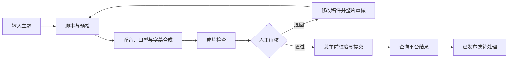

# 视频生成项目：最小 MVP 建议稿

版本：MVP 0.1 建议稿  
日期：2026-09-21  
依据：用户指定的《视频生成项目-完整候选设计稿》C0.1。

## 1. 一句话定义

**一个人使用一个抖音账号，输入一个主题，自动生成一条 30–60 秒的固定数字人口播视频，人工看完后通过或退回，通过后由程序发布并显示结果。**

首版只验证三件事：能否生成可用成片、能否完成审核与一次返工、能否真实发布到抖音。先用少量真实样片跑通，不以播放量、精细画质或无人值守运营作为成功标准。

本文中的裁剪和默认值均为设计建议。本次交付是范围文档，不代表功能已经实现或外部能力已经验证。

### 与现有文档的关系

指定候选稿标注为历史稿；当前目录另有 [PRD v0.35](视频生成平台PRD.md) 和 [技术方案](技术方案.md)，覆盖范围更大。本文按本次要求重新提炼最小方案，供选择首个开发切片，不自动替换原有需求基线。

| 项目 | 当前 PRD | 本文最小方案 |
| --- | --- | --- |
| 内容入口 | 热点检索、自动选题 | 人工输入主题，可粘贴参考文字 |
| 首个内容场景 | AI 工具与效率资讯 | 沿用指定候选稿的办公沟通技巧 |
| 形象与音色 | 上传和文生图双入口、本地 CosyVoice 3 克隆音色 | 预先配好一个形象和一种音色，任务内只复用 |
| 人工参与 | 选题、稿件、发布分别可切换 | 固定一次成片人工审核 |
| 发布后 | 数据回收、策略建议、下一轮应用 | 只查询发布结果 |

若仍需完整保留当前 PRD 中的上述能力，本文只能作为第一阶段交付，不能据此宣称整个 PRD 已完成。固定音色可使用既有 CosyVoice 3 配置；本方案不把音色配置工作台或新增克隆能力列为必需交付。

## 2. 首版固定条件

| 项目 | 建议默认值 |
| --- | --- |
| 用户与账号 | 单用户、单运营账号、绑定一个抖音账号 |
| 领域与受众 | 办公沟通与表达技巧，面向职场新人 |
| 视频 | 纯口播：一个虚拟人物、固定背景、同步字幕 |
| 人物 | 预先选定的、可用于目标用途的非特定真人虚拟形象 |
| 声音 | 固定普通话音色，中性温和；首版不提供音色切换 |
| 时长 | 目标 45 秒，最终成片须在 30–60 秒内 |
| 画面 | 建议 9:16、720×1280，MP4；接入时验证平台兼容性 |
| 脚本 | 问题 → 场景 → 方法 → 一句可复用的话术 |
| 生产节奏 | 手动发起；同一时间最多一个未完成任务 |
| 发布 | 人工通过后立即提交，每天最多成功发布一条；按北京时间计日 |
| 部署 | 当前 Windows 电脑运行，浏览器操作，任务串行执行 |

“一个未完成任务”包括生产中、待审、返工和发布结果待确认。通过审核但当日额度已用完时保留待发布，由用户次日点击继续，不引入自动排期。

## 3. 必须交付的功能

| 功能 | 首版做到什么程度 | 完成标志 |
| --- | --- | --- |
| 新建任务 | 必填一句主题；可粘贴参考文字；其余使用固定配置 | 生成任务编号，可查看输入 |
| 生成脚本 | 产出一份口播稿、标题、简介和话题；按模板组织 | 一条只讲一个问题，人工可查看稿件 |
| 稿件预检 | 检查主题符合、明显事实问题、夸大承诺与风险提示 | 通过后制作；阻断问题进入待处理 |
| 生成视频 | 配音、音频驱动口型、字幕对齐、固定模板合成 | 输出真实可播放的 MP4 和字幕文件 |
| 成片预检 | 检查文件、音轨、画幅、实际时长、字幕时间范围 | 技术问题阻断审核通过，质量疑点供人工判断 |
| 人工审核 | 同屏看视频、稿件、发布文案和检查结果；通过或退回 | 记录制作质量、内容准确性、违规风险三项结论 |
| 简单返工 | 输入一段修改意见，修改稿件并整片重做；也可直接改稿 | 新版本重新检查、重新审核 |
| 发布与回查 | 提交指定审核版本，记录外部标识，查询最终结果 | 区分提交成功与真正已发布 |
| 基础监控 | 任务状态、产物、错误、耗时、费用及重试入口 | 关闭网页后任务仍可运行，重开能看到进度 |

事实内容仅使用本次提供的参考材料；无材料时以经验建议和示例话术为主，不编造数字、研究结论或具体外部事实。依赖资料核验却缺少依据时进入待处理，提示补充文字材料。

字幕必须依据实际音频时间对齐，可使用供应商时间戳或强制对齐工具；不能仅按字数平均分配时间。口型同步和配音是两个独立能力，单有 TTS 不算完成数字人视频。

发布包包括成片、固定模板封面、标题、简介、话题及接入渠道要求的合成内容声明。可下载发布包用于检查，但下载不代表已发布。

## 4. 一条完整使用流程

1. 首次配置模型凭据、固定人物、音色和抖音授权，验证可用性；之后复用。
2. 用户输入“工作汇报怎样先讲清重点”，点击生成。
3. 系统生成脚本和发布文案，预检通过后生成配音、口型视频和字幕，合成成片。
4. 页面进入待审核，用户播放视频并查看三项检查结果。
5. 用户不满意时填写“开场太长，示例改得更口语化”，系统修改稿件并生成新版本。
6. 用户确认三项核查后点击“通过并发布”，程序重新核验版本及发布条件，再提交抖音。
7. 页面持续显示提交和处理状态；确认平台已发布后，展示作品标识及可获取的作品链接。

用户点一次生成只生产一条；发布完成后不自动生成下一条。

## 5. 首版明确不做

| 暂缓内容 | 首版替代方式 |
| --- | --- |
| 自动选题、热点追踪、资料抓取、文件解析 | 人工主题＋粘贴参考文字 |
| 五个独立 Agent 和动态任务分派 | 一个受约束的 Agent，按固定阶段调用 |
| 关键词卡片、图表、画中画、背景音乐、多镜头 | 固定人物＋背景＋字幕 |
| 文生图工作台、人物库、音色库及多候选比较 | 预先配置一套人物和音色 |
| 时间轴批注、局部重生成、自动影响分析 | 文本意见、改稿、整片重做 |
| 复杂版本依赖图和可视化版本对比 | 任务下保存顺序版本 v1、v2，以及审核绑定 |
| 自动排期、定时生产、多账号、多平台 | 单账号手动触发、审核后立即发布 |
| 播放量等运营指标、策略优化、实验系统 | 仅记录发布结果与失败原因 |
| 自动清理、回收站、长期资产管理系统 | 人工清理已结束任务；活动任务和审核记录保留 |
| 多用户登录、权限体系、云端部署 | 单人本机使用 |

## 6. 最小技术结构

保留候选稿要求的 **deepagents + Skills + MCP**，采用固定工作流，不把状态流转交给模型自由决定。

| 部分 | 最小实现 |
| --- | --- |
| 页面 | 两个主页面：任务列表／新建、任务详情／审核；配置先用本地配置文件 |
| 后端与执行 | Python + FastAPI，一个串行 Worker；任务与阶段结果持久化 |
| Agent | 一个 deepagents 实例承担写稿、预检、按意见改稿；每一步独立输入输出 |
| Skills | 三份项目 Skill：`script-writing`、`video-review`、`video-revision` |
| MCP | 一个媒体工具服务，封装配音、人物驱动、字幕对齐、合成与检测；耗时工具返回作业标识供查询 |
| 模型接入 | 固定一个文本模型、一条配音路线、一条数字人路线；可复用现有百炼／CosyVoice 适配方案，具体能力实测 |
| 视频处理 | FFmpeg / ffprobe 负责合成和基础媒体检查 |
| 存储 | SQLite 存任务和记录，本地目录存素材与版本产物 |
| 发布 | 一个抖音发布适配器，由后台校验后调用，Agent 不直接决定或执行发布 |

MCP 必须参与真实媒体工具调用；生成、查询和工具返回值均经后台校验。无需将每个工具拆成独立服务，也无需首版引入 Redis、分布式队列或微服务。

最小数据对象：

- **固定配置**：人物、背景、音色、授权说明、模型和预算限制；凭据单独保存。
- **任务**：输入、当前阶段、当前版本、错误、费用与耗时。
- **内容版本**：稿件、音频、字幕、视频、发布文案、配置快照及文件摘要。
- **审核记录**：被审核版本、三项结论、退回意见、审核时间。
- **发布记录**：目标平台账号、内容版本、提交标识、状态、外部作品标识和查询结果。

不实现通用依赖图。首版改稿后统一重建音频、口型、字幕和视频；标题、封面或其他发布信息修改后也必须重新审核。

## 7. 简化后仍需保留的规则

### 状态与恢复

生产状态：`待执行 → 生产中 → 待审核 → 已通过`；退回后进入新版本生产。异常进入`待处理`，记录失败阶段和已完成产物。

发布状态单独记录：`待发布 → 提交中 → 已提交／平台处理中 → 已发布`，异常区分`明确失败`与`结果待确认`。

程序重启后恢复已保存的任务。外部生成或发布调用若结果未知，先按保存的外部标识查询；无法核实则等待人工处理，不能直接重复创建付费任务或发布。

### 审核与发布一致性

- 审核绑定成片、发布包、固定配置快照及目标平台账号。后台发布时验证仍为该版本。
- 任何影响内容或目标账号的修改均使旧审核失效；页面显示“需要重新审核”。
- 未审核、检查阻断、账号授权无效、已停发或超过当日发布额度时，后台拒绝提交。
- 同一账号、同一内容版本只允许一个有效发布意图；重复点击不重复提交。存在结果待确认的提交时暂停后续发布，直至核实。
- 人物、音色、背景保存来源与使用依据，发布前核查有效性；需要的合成声明纳入审核与提交。

### 费用与返工

- 记录每次模型调用、耗时、预估费用和可获取的实际费用。
- 初次生成后的自动内容修正最多一次，再失败进入待处理；人工每次点击返工只启动一个新版本，不循环自我优化。
- 付费调用前检查预算并预留在途费用，费用未知且无法给出保守上限时暂停调用。
- 若沿用当前项目联调配置，继续采用总额 200 元、首轮 50 元、160 元提醒、200 元停止新增付费调用；本文不放宽已有预算。

## 8. 实施顺序与交付物

| 顺序 | 做什么 | 阶段交付 |
| --- | --- | --- |
| 1. 验证外部能力 | 用同一段短稿测试固定形象、音色、口型与字幕；并行核验抖音账号接入、发布和状态查询条件 | 一条 30–60 秒样片；实际耗时与费用；接入能力记录 |
| 2. 打通生成链路 | 主题输入、写稿预检、媒体工具、合成、文件落盘与状态记录 | 在页面生成并播放成片 |
| 3. 加入审核返工 | 通过／退回、修改意见、版本绑定、一次整片重做、失败恢复 | 完成 v1 退回 → v2 通过 |
| 4. 打通发布 | 发布包、授权校验、提交、回查、防重复、基础监控 | 一条经过人工审核的真实抖音作品及结果记录 |

人物驱动和抖音接入需要实际验证，不预设某个供应商或当前账号一定具备权限。应尽早核验这些依赖，避免页面完成后才发现主链路无法接通。

接入暂未具备条件时，可以先交付生成、审核和发布包导出；应标记为“生成链路完成，真实发布待接入”，不能把模拟提交当作完整 MVP 验收通过。

## 9. 验收清单

建议使用三个固定主题试产：“汇报先讲重点”“求助补充背景”“会前整理议题”。三条逐条制作，至少一条完成真实发布。

- [ ] 三个主题均能生成真实可播放的 30–60 秒竖屏成片，包含人物口播、声音及同步字幕。
- [ ] 人工完整观看，确认语音可理解、字幕基本正确、口型无明显持续错位、内容无未解决阻断项；首版不要求精细表演或高画质。
- [ ] 至少一条完成“退回 → 修改 → 新版本 → 重新审核”，旧审核不能放行新版本。
- [ ] 至少一条通过程序真实提交抖音，并通过平台查询或可核实的平台记录确认已发布，保存作品标识。
- [ ] 未审核发布被拒绝；连续点击发布只创建一次有效提交；超时不会盲目重发。
- [ ] 验证一次生成失败和一次服务重启，能显示原因、保留已有产物并继续或进入明确的待处理状态。
- [ ] 页面能查看每条任务的输入、稿件、成片、检查与审核结果、当前阶段、费用和发布结果。
- [ ] 达到预算限制后停止新付费调用，不影响查看已有产物和核实已提交任务。

首批记录各阶段实际耗时、单条费用和人工退回原因，用于判断下一步优先优化什么。播放量、涨粉与收益不纳入本轮验收。
